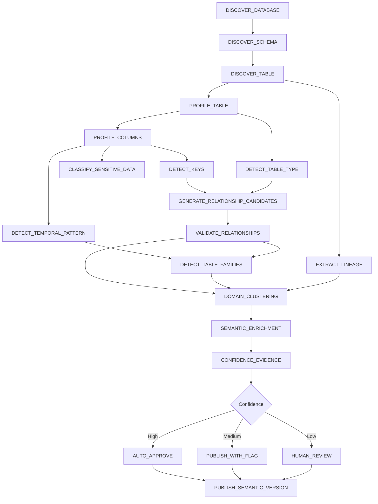
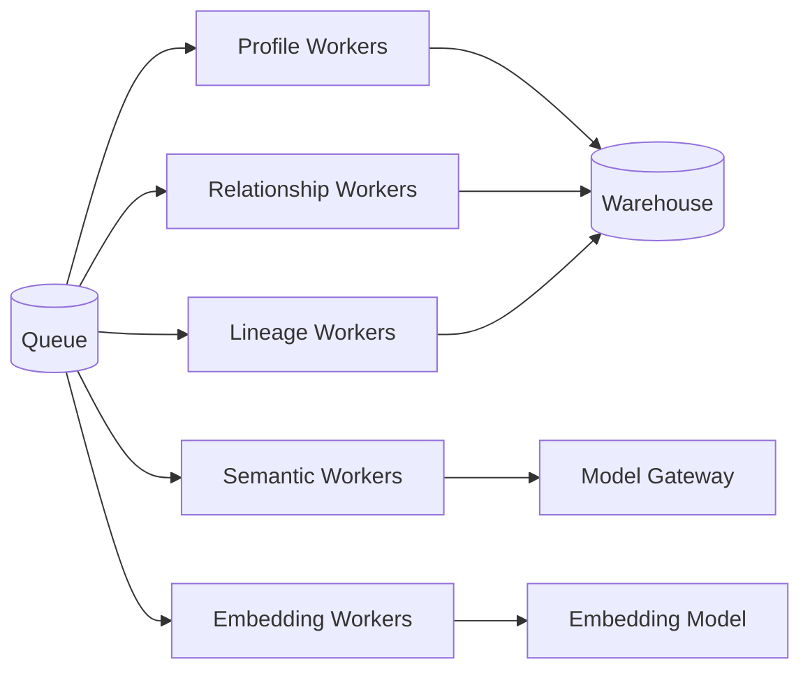
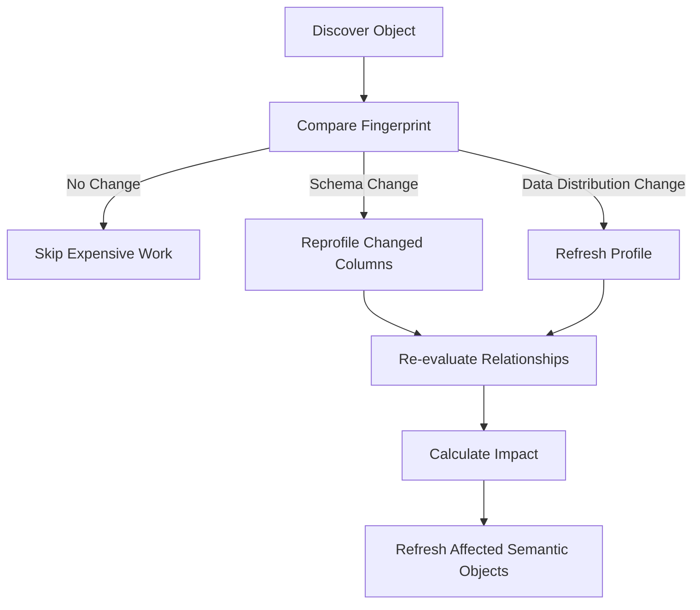

# 02 — Metadata Analysis Engine

## 1. Purpose

The Metadata Analysis Engine converts an unknown enterprise data estate into a governed, evidence-backed semantic model.

It must work for:

- 100 tables
- 1,000 tables
- 10,000+ tables

without requiring one LLM call or one autonomous agent per table.

## 2. Analysis Run

A scan begins with:

```text
AnalysisRun
```

Example:

```json
{
  "run_id": "run_20260824_001",
  "project_id": "finance-ai",
  "datasource_id": "warehouse-prod",
  "mode": "incremental",
  "status": "running",
  "max_source_concurrency": 12,
  "semantic_version_target": "1.8.0"
}
```

## 3. Job DAG



## 4. Job Types

Recommended task types:

```text
DISCOVER_DATABASE
DISCOVER_SCHEMA
DISCOVER_TABLE
DISCOVER_COLUMN

PROFILE_TABLE
PROFILE_COLUMN

DETECT_PRIMARY_KEY
DETECT_COMPOSITE_KEY
DETECT_TABLE_TYPE
DETECT_TEMPORAL_PATTERN
DETECT_LOAD_PATTERN
DETECT_PARTITION_PATTERN
CLASSIFY_SENSITIVE_DATA

GENERATE_RELATIONSHIP_CANDIDATES
VALIDATE_RELATIONSHIP

DETECT_TABLE_FAMILY
RESOLVE_CANONICAL_TABLE

EXTRACT_VIEW_LINEAGE
EXTRACT_SQL_LINEAGE
EXTRACT_ETL_LINEAGE
EXTRACT_QUERY_HISTORY

DISCOVER_DOMAIN
GENERATE_TABLE_SEMANTICS
GENERATE_COLUMN_SEMANTICS
GENERATE_BUSINESS_TERMS
GENERATE_EMBEDDINGS

VALIDATE_SEMANTIC_MODEL
PUBLISH_SEMANTIC_VERSION
```

## 5. Worker Pools

Use different worker pools because tasks have different source and compute characteristics.



Recommended controls:

- per-data-source concurrency
- per-schema concurrency
- query timeout
- warehouse budget
- task priority
- retry count
- exponential backoff
- dead-letter queue
- cancellation
- pause/resume
- maintenance windows

## 6. Table Profiling

### Core Statistics

For every table:

- approximate row count
- storage size
- partition count
- last modified timestamp
- query frequency
- growth rate
- freshness
- candidate grain
- duplicate rate

For every column:

- type
- null count/ratio
- approximate distinct count
- uniqueness ratio
- min/max
- mean/median where relevant
- standard deviation
- length distribution
- top values
- frequencies
- sample patterns
- date ranges
- value entropy
- candidate semantic type
- candidate PII classification

## 7. Adaptive Profiling

Do not use the same strategy for every table.

### Small Table

```text
FULL PROFILE
```

### Medium Table

```text
DATABASE STATISTICS
+
SAMPLE
+
TARGETED AGGREGATES
```

### Large Fact Table

```text
PARTITION-AWARE SAMPLE
+
APPROX_COUNT_DISTINCT
+
RECENT PARTITION
+
HISTORICAL PARTITION
+
DATABASE CATALOG STATISTICS
```

The profiler should never accidentally launch an uncontrolled full scan of a multi-billion-row table.

## 8. Key Detection

### Single-Column Candidate Key

Example score:

```text
candidate_pk_score =
  uniqueness * 0.45
+ non_null_ratio * 0.20
+ name_score * 0.10
+ stability_score * 0.10
+ index_evidence * 0.10
+ usage_evidence * 0.05
```

### Composite Key Search

Search should be bounded.

Candidate columns should first be selected from:

- high-cardinality columns
- business identifiers
- declared indexes
- commonly joined columns
- temporal columns when grain suggests period-specific uniqueness

Then test combinations up to a configured maximum cardinality.

## 9. Relationship Candidate Generation

Brute-force all-pairs comparison is not acceptable.

If there are 25,000 columns, do not compare every column to every other column.

### Candidate Pruning

Generate candidates based on:

- exact normalized name
- suffix/prefix similarity
- semantic name similarity
- compatible types
- PK/unique target
- common business domain
- table usage
- historical joins
- lineage
- embedding similarity
- schema proximity

### Relationship Validation

Then run expensive evidence checks only on candidates.

Example:

```text
transaction.customer_id
    ->
customer.customer_id
```

Evidence:

```text
name similarity               .98
type compatibility           1.00
target uniqueness             .99
value containment             .997
query-history evidence        .95
ETL evidence                 1.00
LLM semantic evidence         .82
```

## 10. Relationship Confidence

Recommended evidence hierarchy:

| Evidence | Typical confidence |
|---|---:|
| Declared DB foreign key | 1.00 |
| Human-approved relationship | 1.00 |
| Explicit transformation lineage | 0.98 |
| Repeated production SQL join | 0.95 |
| Strong value containment + unique target | 0.90 |
| Naming + type + domain inference | 0.75 |
| LLM-only inference | 0.55–0.70 |

A relationship object should retain all underlying evidence, not only a final score.

## 11. Temporal / History Detection

Detect:

- snapshot tables
- append-only fact tables
- CDC/delta tables
- SCD Type 1
- SCD Type 2
- event streams
- daily partitions
- monthly snapshots
- current/history pairs

Signals include:

```text
effective_from
effective_to
valid_from
valid_to
snapshot_date
batch_date
load_date
ingest_timestamp
current_flag
version_number
operation_type
```

### Example

```json
{
  "table": "customer_history",
  "table_type": "DIMENSION_HISTORY",
  "history_strategy": "SCD2",
  "business_key": ["customer_id"],
  "effective_from": "valid_from",
  "effective_to": "valid_to",
  "current_indicator": "is_current"
}
```

## 12. Table Family Detection

Enterprise warehouses often contain:

```text
customer
customer_current
customer_hist
customer_delta
customer_snapshot
customer_backup
```

The system should create:

```text
TableFamily: CUSTOMER
```

with relationships:

```text
customer_current -HISTORICAL_VERSION-> customer_hist
customer_current -CHANGE_FEED-> customer_delta
customer_current -SNAPSHOT_VERSION-> customer_snapshot
customer_backup -ARCHIVE_OF-> customer_current
```

Signals:

- name similarity
- column overlap
- key overlap
- lineage
- history fields
- load pattern
- usage
- row behavior

## 13. Canonical Table Resolver

For each business concept, determine the default analytical table.

Example:

```text
Business concept: CUSTOMER

Candidates:
RAW.crm_customer               score .42
STAGE.customer_stage           score .37
CURATED.customer_dim           score .96
HISTORY.customer_hist          score .72
```

Suggested scoring:

```text
canonical_score =
  semantic_confidence
+ query_usage
+ downstream_usage
+ data_quality
+ freshness
+ curated_layer_weight
+ stewardship_approval
- deprecated_penalty
- duplicate_penalty
```

The runtime agent should prefer the canonical table unless the user's question requires history or another specialized representation.

## 14. Domain Discovery

Cluster tables into domains such as:

- Customer
- Account
- Payments
- Claims
- Product
- Finance
- Risk
- Sales
- Marketing

Inputs:

- schema names
- table/column names
- descriptions
- query co-usage
- graph connectivity
- lineage
- existing catalog tags
- embeddings

LLMs are useful here after deterministic clustering has reduced the search space.

## 15. Semantic Enrichment

The LLM receives compact metadata, not raw tables.

Example payload:

```text
Table: transaction_fact
Rows: 1.8B
Grain: probable one-row-per-transaction
PK: transaction_id [0.99]
FK candidates:
  customer_id -> customer_dim.customer_id [0.98]
  merchant_id -> merchant_dim.merchant_id [0.97]
Measures:
  amount
  tax_amount
  fee_amount
Time:
  transaction_timestamp
Load:
  daily incremental
Usage:
  42K queries / 90 days
```

Requested outputs:

- business description
- business domain
- semantic concepts
- measures/dimensions
- synonyms
- table purpose
- likely analytical use cases
- ambiguous meanings
- recommended glossary mappings

## 16. Incremental Reanalysis

Store fingerprints:

```text
schema_hash
column_hash
constraint_hash
profile_hash
sample_fingerprint
lineage_hash
query_usage_hash
```

On subsequent scans:



## 17. Priority Scheduling

Not all tables are equal.

Recommended `importance_score` inputs:

- query frequency
- BI/report usage
- downstream dependencies
- graph centrality
- business stewardship tags
- number of relationships
- data volume/activity
- freshness requirements

This allows the platform to semantically enrich the most important 10% of tables first.

## 18. Ambiguity Review Queue

Example:

```text
Object:
orders.account_ref

Candidates:
account.account_id              0.74
customer_account.account_id     0.71
legacy_account.id               0.68

Decision required:
[Approve] [Reject] [Create New Relationship]
```

Review decisions must be durable evidence.

## 19. Negative Knowledge

Persist rejected hypotheses:

```text
NOT_A_RELATIONSHIP
NOT_PII
NOT_A_PRIMARY_KEY
NOT_CANONICAL
NOT_A_METRIC
```

Without this, the system will repeatedly rediscover the same bad hypothesis.

## 20. Failure Handling

Every task records:

```text
status
attempt_count
last_error
error_class
started_at
finished_at
worker_id
source_query_id
resource_usage
```

Failure classes:

- authentication
- source unavailable
- timeout
- throttling
- permission denied
- malformed metadata
- unsupported dialect
- query cost rejected
- semantic model failure
- LLM failure

Retries should apply only where meaningful.

## 21. Large-Scale Example

For 1,000 tables / 25,000 columns:

```text
1       datasource discovery
20      schema jobs
1,000   table profiling jobs
25,000  column profile operations
~4,000  relationship candidates
~700    expensive relationship validations
~100    table family analyses
~20     domain analyses
~250    semantic LLM enrichment tasks
1       semantic validation/publish task
```

This is a worker scheduling problem, not a 1,000-agent problem.
