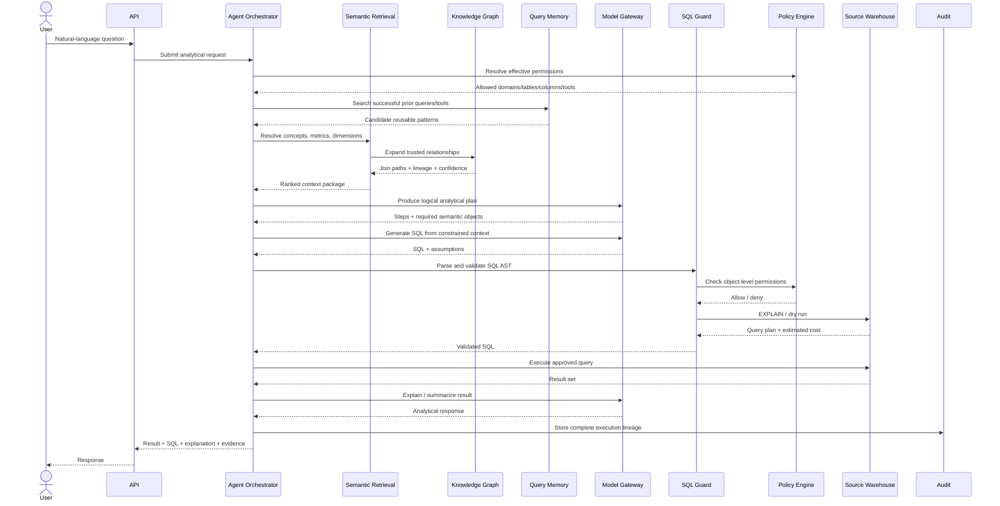
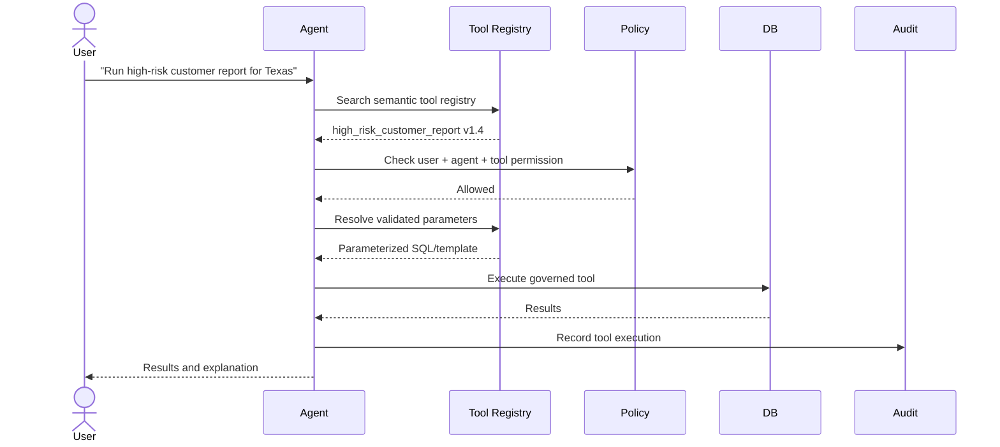
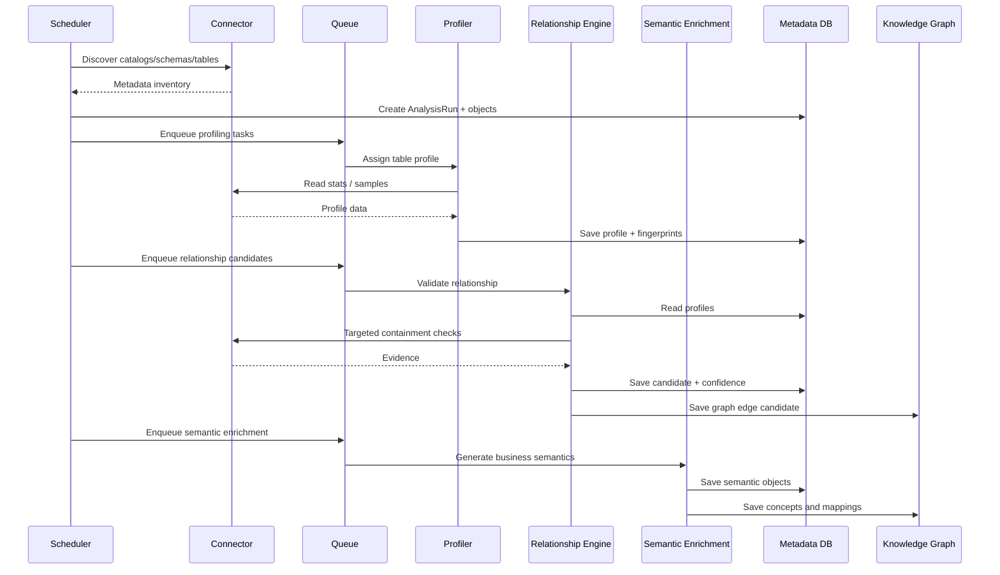
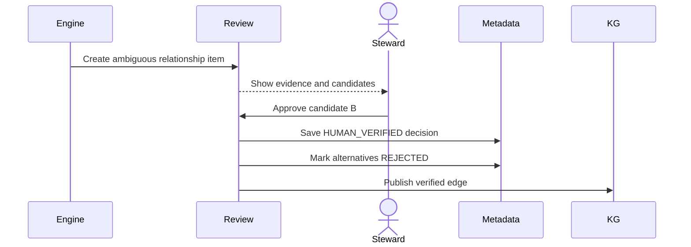
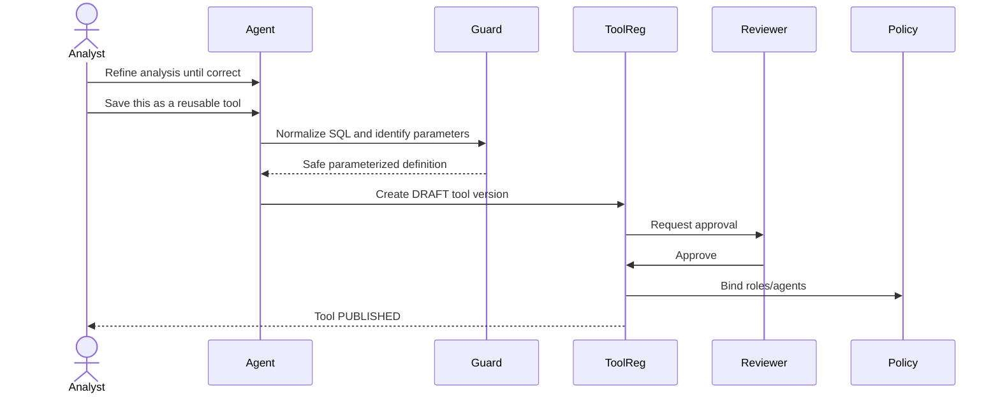
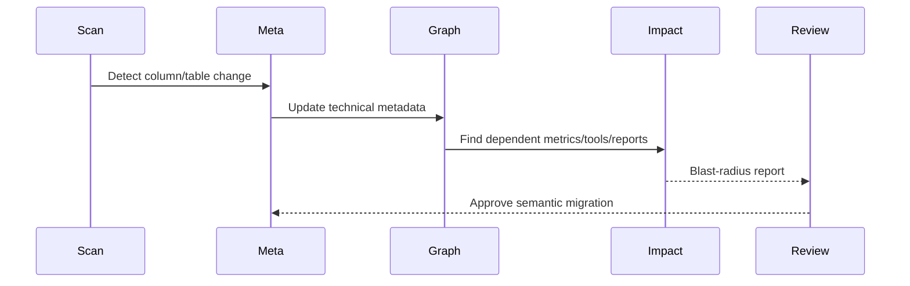
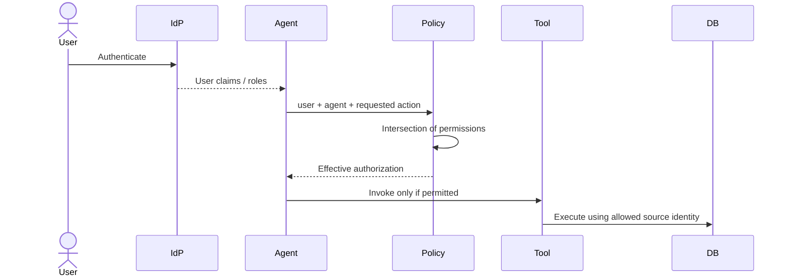
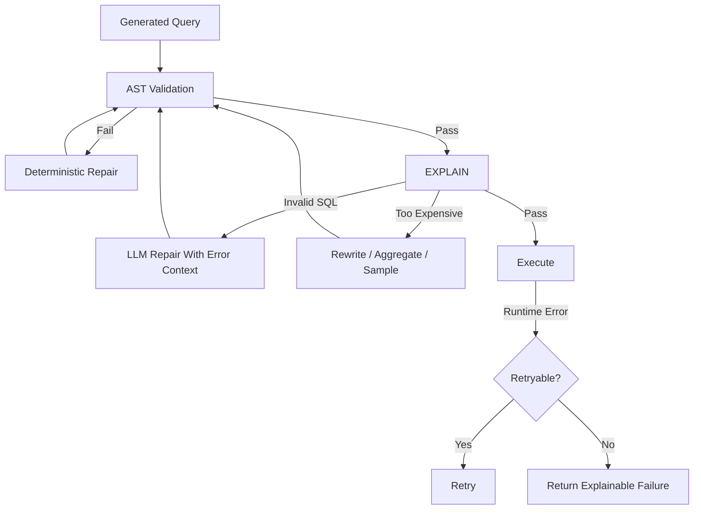
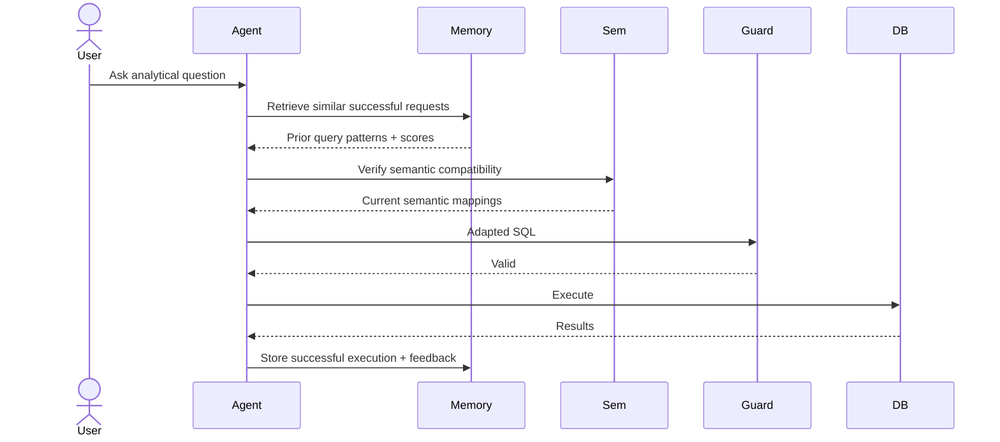
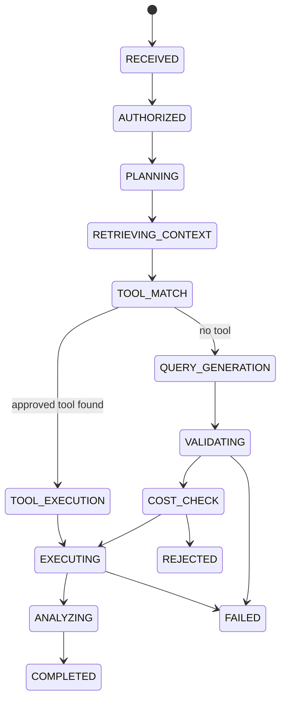

# 03 — Agent Runtime and Sequence Diagrams

## 1. Runtime Design Principle

Natural language should not be translated directly to SQL in one step.

The runtime pipeline is:

```text
Understand
→ Plan
→ Resolve Semantics
→ Reuse Tool if Possible
→ Retrieve Context
→ Build Logical Plan
→ Generate SQL
→ Validate
→ Authorize
→ Estimate Cost
→ Execute
→ Validate Result
→ Explain
→ Learn
```

## 2. Standard NL-to-SQL Sequence



## 3. Approved Tool Reuse Sequence



## 4. Multi-Step Analytical Request

Example request:

> Find Texas customers whose average spend increased more than 30% in the last six months versus the previous six months and who had at least three complaints. Compare their churn rate to the overall Texas customer population.

Planner:

```text
Step 1 — resolve Texas customer population
Step 2 — compute spend for current six-month window
Step 3 — compute spend for previous six-month window
Step 4 — calculate growth
Step 5 — filter growth > 30%
Step 6 — aggregate complaints
Step 7 — filter complaint_count >= 3
Step 8 — calculate churn rate for cohort
Step 9 — calculate churn rate for Texas population
Step 10 — compare and explain
```

The planner may execute one optimized SQL query or multiple staged queries depending on the warehouse and complexity.

## 5. Metadata Discovery Sequence



## 6. Human Review Sequence



## 7. Promote Analysis to Tool



## 8. Tool Execution Lineage

Every tool call should create a trace:

```text
User
→ Agent
→ Tool version
→ Semantic version
→ Policy version
→ Data source
→ Tables
→ Columns
→ Query
→ Warehouse execution ID
→ Result metadata
```

## 9. Semantic Change Impact Sequence



## 10. Agent Identity and Authorization Sequence



Effective permission:

```text
User permissions
∩ Agent permissions
∩ Tool permissions
∩ Project permissions
∩ Source-system permissions
```

## 11. Query Failure Recovery

Possible flow:



Set a strict repair-attempt limit to avoid uncontrolled LLM loops.

## 12. Query Memory Sequence



## 13. Runtime State Machine


