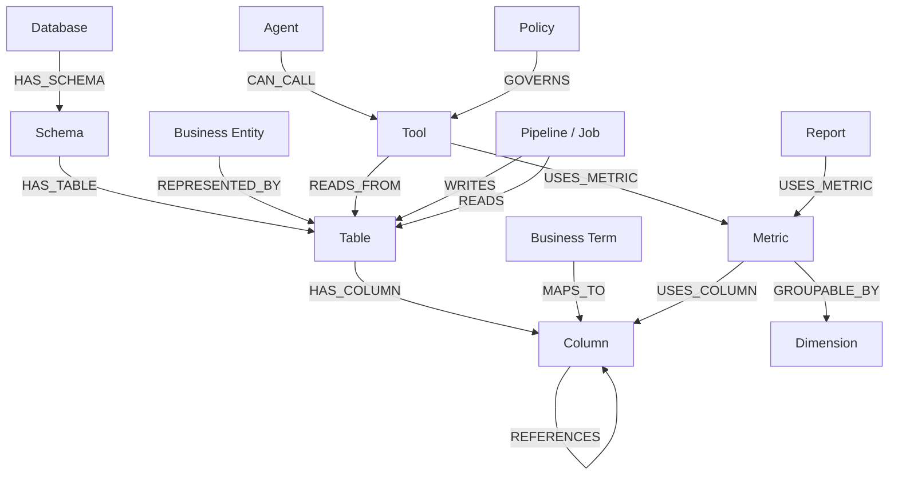

# 04 — Data, Semantic and Lineage Model

## 1. PostgreSQL Core Model

Recommended logical entities:

### Project / Source

```text
project
datasource
datasource_connection
catalog
schema
table
column
constraint
index
partition
```

### Profiling

```text
analysis_run
analysis_task
table_profile
column_profile
profile_artifact
object_fingerprint
```

### Relationships

```text
relationship_candidate
relationship_evidence
relationship_decision
table_family
table_family_member
canonical_table_mapping
```

### Semantic

```text
business_domain
business_entity
business_term
synonym
semantic_mapping
dimension
measure
metric
metric_version
semantic_model_version
```

### Runtime

```text
query_session
query_request
logical_plan
generated_query
query_execution
query_feedback
query_memory
```

### Tooling / Agent / Model

```text
tool
tool_version
tool_parameter
tool_dependency

agent
agent_version
model
model_endpoint
model_route
```

### Governance

```text
role
permission
policy
policy_version
principal_binding
data_classification
review_item
review_decision
audit_event
```

## 2. Example Table Metadata

```json
{
  "table_id": "tbl_123",
  "catalog": "analytics",
  "schema": "finance",
  "name": "transaction_fact",
  "table_type": "FACT",
  "grain": "one row per transaction",
  "load_pattern": "DAILY_INCREMENTAL",
  "history_strategy": "APPEND_ONLY",
  "canonical_score": 0.96,
  "importance_score": 0.93,
  "semantic_confidence": 0.94
}
```

## 3. Example Column Metadata

```json
{
  "column_id": "col_123",
  "table_id": "tbl_123",
  "name": "customer_id",
  "physical_type": "BIGINT",
  "semantic_type": "CUSTOMER_IDENTIFIER",
  "nullable": false,
  "distinct_ratio": 0.021,
  "pii_classification": "INTERNAL_IDENTIFIER",
  "candidate_fk": true
}
```

## 4. Semantic Metric Model

A metric should be independent of one physical SQL string.

Example:

```yaml
metric:
  name: total_revenue
  version: 3
  business_name: Total Revenue
  description: Recognized completed transaction revenue
  base_entity: transaction
  expression:
    type: aggregate
    function: sum
    measure: transaction.amount
  filters:
    - transaction.status = COMPLETED
  default_time_dimension: transaction.transaction_date
  allowed_dimensions:
    - customer
    - product
    - region
    - channel
  grain: transaction
```

## 5. Time Semantics

The semantic model must understand:

- event date
- posting date
- settlement date
- effective date
- snapshot date
- load date
- fiscal period
- calendar period

A request like:

> Revenue last month

must resolve to the business-approved time semantic, not blindly choose the first date column.

## 6. Graph Model



## 7. Technical Lineage

Technical lineage should capture:

```text
source column
→ transformation
→ target column
```

Example:

```text
raw_orders.gross_amount
  ↓
stg_orders.gross_amount
  ↓
fact_orders.net_amount
  ↓
metric.net_revenue
```

Sources:

- view SQL
- stored procedures
- ETL SQL
- dbt manifests
- Spark jobs
- Airflow
- query logs
- OpenLineage events
- notebook metadata

### Implemented dbt artifact contract

Atlas registers a dbt project against one governed delivery project and one warehouse datasource. Each `manifest.json` import becomes an immutable `dbt_artifact_import`; extracted `dbt_resource` records represent models, sources, tests and other supported nodes, while `dbt_lineage_edge` records preserve directed `depends_on` relationships.

The raw manifest is not stored. Compiled SQL is retained only when SQLGlot can parse it with the datasource dialect, remove comments and replace all literals with placeholders; a SHA-256 fingerprint is retained whether or not normalization succeeds. Relation-bearing resources are deterministically matched to active catalog tables using database/schema/relation identity, with an unambiguous schema/relation fallback when the artifact omits a database.

dbt remains responsible for compiling and executing transformations in its target warehouse. Atlas uses the artifact for discovery, impact, retrieval and governance; it never executes imported artifact SQL.

## 8. AI / Agent Lineage

Capture:

```text
User Question
→ Agent Version
→ Model Version
→ Retrieved Semantic Objects
→ Retrieved Tools
→ Logical Plan
→ Generated SQL
→ Policy Decision
→ Query Execution
→ Result
→ Explanation
```

This allows:

- reproducibility
- debugging
- compliance review
- model comparison
- incident investigation

## 9. Confidence Model

Every inferred object should have:

```text
confidence_score
status
evidence[]
inference_method
created_by
verified_by
verified_at
semantic_version
```

Statuses:

```text
PROPOSED
AUTO_APPROVED
REVIEW_REQUIRED
HUMAN_VERIFIED
REJECTED
DEPRECATED
```

## 10. Evidence Model

Example:

```json
{
  "relationship": "orders.customer_id -> customer.customer_id",
  "confidence": 0.985,
  "evidence": [
    {"type": "NAME_SIMILARITY", "score": 0.98},
    {"type": "TYPE_COMPATIBILITY", "score": 1.0},
    {"type": "VALUE_CONTAINMENT", "score": 0.997},
    {"type": "QUERY_HISTORY_JOIN", "count": 24562, "score": 0.96},
    {"type": "TARGET_UNIQUENESS", "score": 0.99}
  ]
}
```

## 11. Negative Evidence

Example:

```json
{
  "object": "orders.account_id -> account_archive.account_id",
  "decision": "REJECTED",
  "reason": "archive table is not the authoritative analytical source",
  "reviewed_by": "data-steward",
  "effective_from": "2026-08-24"
}
```

Negative decisions should participate in future candidate ranking.

## 12. Semantic Versioning

Every runtime execution should reference:

```text
metadata_version
semantic_model_version
metric_version
tool_version
agent_version
model_version
policy_version
```

This prevents:

> "The same question returned a different interpretation six months later and we do not know why."

## 13. Blast Radius

Graph traversal should answer:

> What breaks if `transaction.amount` changes?

Example:

```text
transaction.amount
→ total_revenue
→ customer_profitability
→ high_risk_customer_tool
→ finance_agent
→ executive_revenue_dashboard
```

## 14. Query Memory

A memory record should include:

```text
normalized_intent
original_question
semantic_entities
metric_ids
dimension_ids
table_ids
relationship_path
SQL
execution_status
latency
cost
result_shape
user_feedback
usage_count
last_used_at
```

Similarity retrieval should prefer:

1. successful executions
2. human-approved queries
3. current semantic version compatibility
4. high user feedback
5. recent usage

## 15. Tool Model

```yaml
tool:
  name: high_risk_customer_report
  version: 1.4
  status: PUBLISHED
  semantic_description: >
    Returns customers whose spend growth and complaint activity
    exceed configured thresholds.
  parameters:
    region:
      type: string
      required: true
    period_months:
      type: integer
      default: 6
    min_growth_pct:
      type: decimal
      default: 30
    min_complaints:
      type: integer
      default: 3
  dependencies:
    metrics:
      - monthly_customer_spend
      - complaint_count
    entities:
      - customer
      - support_case
  authorization:
    roles:
      - analyst
      - risk_manager
```
