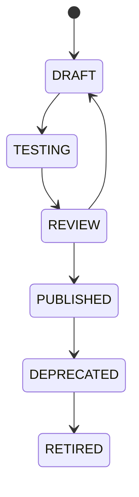

# 05 — Security, Governance and API Specification

## 1. Security Principles

1. Least privilege.
2. Source authorization remains authoritative.
3. Agents have identities.
4. Tools have permissions.
5. Metadata retrieval is permission-aware.
6. LLM context must exclude unauthorized metadata and sensitive values.
7. Generated SQL must be validated before execution.
8. Every access must be auditable.
9. Secrets must never be inserted into prompts.
10. Sensitive source data should not be persisted unless explicitly required.

## 2. Identity Model

Principals:

```text
USER
SERVICE_ACCOUNT
AGENT
TOOL
WORKER
MODEL_ENDPOINT
```

The policy engine evaluates:

```text
principal
action
resource
project
environment
data_classification
context
```

Current implementation verifies OIDC bearer tokens against pinned or remotely cached JWKS, allowlists asymmetric signing algorithms, validates issuer/audience/time/subject claims, maps external roles to platform roles, and validates the organization claim as a UUID. Development request headers are an explicit local-only provider and configuration refuses them in production.

Datasource credentials are stored only as strict provider references. Exactly one deployment-selected provider scheme is accepted, adapters must be explicitly registered, cache lifetime is bounded, and rotation can invalidate cached material. Production refuses the local `env` provider.

## 3. RBAC

Example roles:

```text
PlatformAdmin
ProjectAdmin
DataAdmin
MetadataAdmin
BusinessSteward
Analyst
AgentDeveloper
ToolDeveloper
Reviewer
Viewer
```

## 4. ABAC

Examples:

```text
department == "finance"
AND region == "US"
AND data_classification NOT IN ["PCI", "SECRET"]
```

or:

```text
project == "customer360"
AND environment != "production"
```

## 5. Agent Permission Model

An agent should never gain more permission than the requesting user.

Effective privilege:

```text
effective_access =
    user_access
  ∩ agent_access
  ∩ tool_access
  ∩ project_access
  ∩ datasource_access
```

## 6. Tool Governance

Tool lifecycle:



Each version stores:

- SQL/template/logical definition
- parameters
- semantic dependencies
- data dependencies
- allowed agents
- allowed roles
- review history
- test results
- owner
- sensitivity level
- cost expectations

## 7. SQL Security Guard

The guard should parse SQL into an AST and check:

- referenced tables
- referenced columns
- write operations
- DDL
- dynamic SQL
- unsupported functions
- cross joins
- unbounded scans
- row limits
- sensitive columns
- forbidden schemas
- invalid join paths
- missing tenant filters
- policy filters
- estimated query cost

The runtime should permit `SELECT` by default and require explicit elevated policies for any write capability.

## 8. Data Classification

Recommended classes:

```text
PUBLIC
INTERNAL
CONFIDENTIAL
PII
PHI
PCI
SECRET
```

Metadata should contain classification at:

- table level
- column level
- semantic entity level
- metric level
- tool level

## 9. LLM Context Protection

Before sending metadata or examples to a model:

```text
Permission filter
→ Sensitivity filter
→ Masking
→ Token reduction
→ Prompt construction
```

Never send:

- credentials
- secrets
- raw tokens
- unrestricted PII samples
- full sensitive rows

unless a separately approved use case explicitly allows it.

## 10. External Integration Registry

External integrations should be first-class resources:

```text
integration
integration_type
endpoint
credential_reference
allowed_agents
allowed_tools
allowed_operations
rate_limit
environment
status
```

Examples:

- REST APIs
- SaaS systems
- enterprise services
- MCP servers
- messaging
- BI platforms

## 11. API Surface

### Projects

```http
POST   /v1/projects
GET    /v1/projects/{project_id}
PATCH  /v1/projects/{project_id}
```

### Data Sources

```http
POST   /v1/projects/{project_id}/datasources
POST   /v1/datasources/{id}/test
POST   /v1/datasources/{id}/discover
GET    /v1/datasources/{id}/schemas
GET    /v1/datasources/{id}/knowledge-graph
```

### Analysis Runs

```http
POST   /v1/datasources/{id}/analysis-runs
GET    /v1/analysis-runs/{run_id}
POST   /v1/analysis-runs/{run_id}/cancel
POST   /v1/analysis-runs/{run_id}/resume
GET    /v1/analysis-runs/{run_id}/tasks
```

### Metadata

```http
GET    /v1/tables/{table_id}
GET    /v1/tables/{table_id}/profile
GET    /v1/tables/{table_id}/relationships
GET    /v1/tables/{table_id}/lineage
GET    /v1/columns/{column_id}
```

### Semantic

```http
GET    /v1/semantic/entities
GET    /v1/semantic/metrics
POST   /v1/semantic/metrics
POST   /v1/semantic/publish
```

### Relationships

```http
GET    /v1/review/relationships
POST   /v1/relationships/{id}/approve
POST   /v1/relationships/{id}/reject
```

### Agent Runtime

```http
POST   /v1/analysis/query
GET    /v1/analysis/query/{request_id}
POST   /v1/analysis/query/{request_id}/feedback
GET    /v1/ai/runtime-status
```

### Model Route Governance

```http
POST   /v1/organizations/{organization_id}/model-routes
GET    /v1/organizations/{organization_id}/model-routes
POST   /v1/model-routes/{route_id}/submit
POST   /v1/governance/decisions
```

Model-route definitions are versioned maker-checker records. Credential references are
opaque on write and are never returned by read APIs. Approval establishes governance
state only: runtime selection, adapter registration, private connectivity, evaluation
gates, and the generation kill switch remain independent activation controls.

### Tools

```http
POST   /v1/tools
GET    /v1/tools
GET    /v1/tools/{tool_id}
POST   /v1/tools/{tool_id}/publish
POST   /v1/tools/{tool_id}/execute
```

### Graph / Lineage

```http
GET    /v1/graph/neighbors
GET    /v1/lineage/upstream
GET    /v1/lineage/downstream
GET    /v1/impact
GET    /v1/query-executions/{execution_id}/lineage
```

The bounded datasource knowledge-graph response combines authoritative catalog nodes,
declared foreign keys, and separately labelled relationship suggestions. Suggested
edges retain confidence and evidence and cannot become approved relationships without
an independent governance decision.

## 12. Query Request Contract

Example:

```json
{
  "project_id": "finance-ai",
  "question": "Show monthly revenue by state for the last six months",
  "mode": "analysis",
  "max_rows": 5000,
  "include_sql": true
}
```

Response:

```json
{
  "request_id": "qry_123",
  "status": "completed",
  "interpretation": {
    "metric": "total_revenue",
    "dimensions": ["state"],
    "time_range": "last_6_months"
  },
  "sql": "SELECT ...",
  "result": {
    "columns": ["month", "state", "revenue"],
    "row_count": 212
  },
  "lineage": {
    "tables": ["transaction_fact", "customer_dim"],
    "metrics": ["total_revenue"]
  },
  "confidence": 0.96
}
```

## 13. Audit Event

```json
{
  "event_type": "QUERY_EXECUTED",
  "user_id": "usr_123",
  "agent_id": "finance_analyst_v3",
  "tool_id": null,
  "semantic_version": "1.8.0",
  "policy_version": "2.4.1",
  "tables": ["transaction_fact", "customer_dim"],
  "columns": ["amount", "transaction_date", "state"],
  "warehouse_query_id": "snowflake-...",
  "timestamp": "2026-08-24T23:00:00-04:00"
}
```

## 14. Governance Review Types

Create review workflows for:

- inferred relationships
- semantic mappings
- canonical-table changes
- metrics
- tools
- model onboarding
- external integrations
- high-risk policies

## 15. Approval Thresholds

Example:

```text
confidence >= .95       automatic publish if low risk
.80 <= confidence < .95 publish with review flag
confidence < .80        human approval required
```

Thresholds should vary by object type and business criticality.
