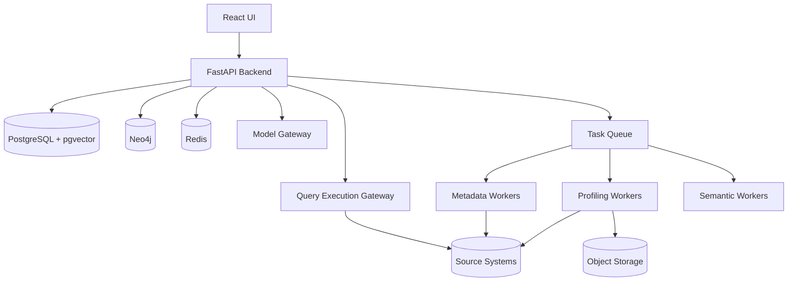
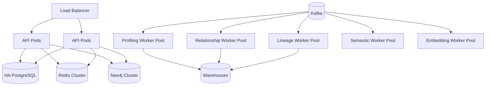

# 06 — Deployment, Scaling and Operations

## 1. Recommended MVP Topology

Start with a modular monolith plus workers.



Do not begin with dozens of microservices unless operational requirements justify them.

## 2. Scale-Out Topology

At enterprise scale:



## 3. Queue Strategy

Recommended logical queues/topics:

```text
metadata.discovery
profile.table
profile.column
relationship.candidate
relationship.validate
lineage.extract
semantic.enrich
embedding.generate
semantic.publish
audit.events
```

## 4. Redis Usage

Use Redis for:

- user sessions
- distributed locks
- request state
- short-lived agent state
- metadata cache
- semantic retrieval cache
- query result cache where allowed
- rate limiting
- idempotency keys

Do not use Redis as:

- semantic source of truth
- permanent lineage store
- permanent audit store

## 5. Kafka Usage

Introduce Kafka when needed for:

- durable event processing
- high job volume
- replay
- independent consumers
- lineage events
- CDC/schema-change events
- decoupled indexing

For smaller deployments, a simpler queue such as Celery/Redis may be adequate.

## 6. Connection Management

Maintain separate pools by:

```text
datasource
environment
credential
workload type
```

Do not allow the metadata profiler to consume all warehouse connections needed by interactive users.

Suggested classes:

```text
INTERACTIVE_QUERY
METADATA_DISCOVERY
PROFILING
RELATIONSHIP_VALIDATION
LINEAGE
ADMIN
```

Each class gets its own concurrency and cost limits.

## 7. Capacity Model

### Small

```text
<= 1,000 tables
<= 25,000 columns
<= 5 concurrent users
```

Possible:

- 1 API deployment
- 1 PostgreSQL
- 1 Neo4j
- Redis
- 4–10 workers

### Medium

```text
1,000–20,000 tables
25K–500K columns
10–200 concurrent users
```

Use:

- autoscaled workers
- durable queue
- read replicas
- larger Neo4j
- partitioned analysis workloads
- object-storage artifacts

### Large

```text
20,000–100,000+ tables
500K–5M+ columns
multiple business units
```

Need:

- metadata partitioning/sharding strategy
- distributed queues
- domain-scoped scans
- per-source schedulers
- strong workload governance
- graph partition strategy
- staged indexing
- multi-region planning if required

## 8. Backpressure

If a warehouse begins throttling:

```text
source latency rises
→ profiler observes throttling
→ scheduler reduces concurrency
→ queue grows safely
→ interactive workload remains protected
```

## 9. Cost Governance

### Warehouse

Track:

- estimated bytes scanned
- credits
- query duration
- rows scanned
- partitions scanned

### LLM

Track:

- model
- input tokens
- output tokens
- task type
- cache hit
- retry count
- estimated cost

### Budget Policy

Example:

```text
table semantic enrichment:
use small model by default

complex ambiguous domain:
use reasoning model

unchanged table:
no LLM call
```

## 10. Observability

Metrics:

### Analysis

```text
analysis_runs_total
analysis_task_latency
tasks_failed
tables_profiled_per_minute
relationship_candidates
review_queue_depth
semantic_publish_latency
```

### Runtime

```text
agent_request_latency
semantic_retrieval_latency
tool_reuse_rate
sql_generation_rate
sql_validation_failure_rate
warehouse_execution_latency
query_success_rate
user_correction_rate
```

### LLM

```text
tokens_per_request
cost_per_request
semantic_enrichment_cost
model_failure_rate
model_route_distribution
```

### Quality

```text
verified_relationship_precision
canonical_table_accuracy
text_to_sql_execution_accuracy
text_to_sql_semantic_accuracy
metric_resolution_accuracy
```

## 11. Logging

Structured logs should include:

```text
trace_id
request_id
analysis_run_id
task_id
user_id
agent_id
tool_id
model_id
datasource_id
warehouse_query_id
```

Never log:

- passwords
- tokens
- unmasked secrets
- sensitive result payloads by default

## 12. High Availability

Production targets should define:

- PostgreSQL replication
- backup/restore
- Neo4j cluster/backup
- Redis HA
- queue durability
- object-storage versioning
- stateless API replicas
- worker re-delivery
- idempotent tasks

## 13. Disaster Recovery

Define:

```text
RPO
RTO
backup frequency
cross-region copy
semantic-model restore
audit retention
```

Metadata and semantic state are valuable intellectual assets and should be treated as critical data.

## 14. Environment Strategy

```text
DEV
TEST
STAGING
PRODUCTION
```

Each environment should have:

- independent secrets
- independent model routes
- environment-specific source connections
- policy boundaries
- deployment approvals

## 15. Multi-Tenancy

Recommended tenant boundaries:

```text
tenant
→ project
→ datasource
→ semantic version
→ agent/tool registry
```

Enforce tenant isolation in:

- PostgreSQL row-level security or tenant partitioning
- graph queries
- vector retrieval
- caches
- object storage
- audit

## 16. Release Strategy

Version:

- APIs
- semantic model
- tool definitions
- agents
- prompts
- policies
- model routes

Support rollback for semantic changes.

## 17. Phased Delivery

### Phase 1 — Metadata Foundation

- project/source management
- schema discovery
- table/column metadata
- profiler
- analysis scheduler
- PostgreSQL
- basic UI

### Phase 2 — Relationship Intelligence

- key inference
- FK inference
- confidence/evidence
- human review
- Neo4j
- graph explorer

### Phase 3 — Semantic Layer

- business descriptions
- domains
- entities
- metrics
- canonical tables
- vector retrieval

### Phase 4 — NLP Analyst

- intent
- planner
- semantic retrieval
- NL-to-SQL
- SQL guard
- execution
- explanation

### Phase 5 — Tool Registry

- save analysis as tool
- approval
- versioning
- parameterization
- agent tool invocation

### Phase 6 — Enterprise Governance

- RBAC/ABAC
- agent identity
- policy engine
- audit
- lineage
- impact analysis

### Phase 7 — Optimization

- query memory
- model routing
- cost controls
- incremental semantic refresh
- advanced evaluation
