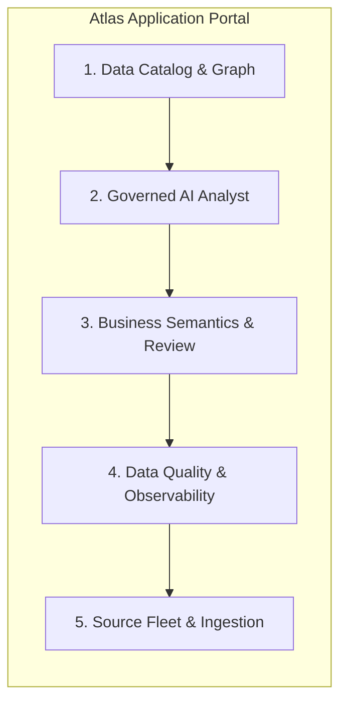

# Master Application Strategy & Product Plan: Beating the Governance & AI Catalog Market

> **Document Status**: Authoritative Strategy & Product Architecture Plan  
> **Platform Target**: Atlas / Bank Data Intelligence Platform  
> **Key Baseline Baseline**: Atlan, Collibra, Alation, Microsoft Purview, Databricks Unity Catalog  

---

## 1. Executive Summary & Core Positioning Strategic Thesis

Market competitors (Atlan, Collibra, Alation) treat metadata as an **out-of-band context product** — they collect schema tags, business terms, and lineage, and hand that context off to third-party LLMs or users. 

**This creates a critical vulnerability for regulated banking institutions:** context governance is separated from query execution governance. An LLM agent reading Atlan metadata can still generate hallucinated, unmasked, or un-audited SQL directly on database compute.

### Our Winning Strategic Thesis
Our platform (**Atlas**) does not compete as a generic catalog. It wins by being the **first bank-safe, governed AI data operating system** that unifies:
1. **Governed Metadata Cataloging** (dbt manifest intelligence, schema profiling, column lineage).
2. **Deterministic In-Path Query Execution** (prompt risk screening, SQL parser validation, masking).
3. **Live AI Analyst Agent** (approved-tool-first planning, tool publication workflows, audit trace).
4. **Maker-Checker Governance** (business term promotion, human-in-the-loop validation).

---

## 2. Comprehensive Competitive Feature Matrix

| Capability Dimension | Atlan | Collibra | Alation | MS Purview | Unity Catalog | **Atlas (Our Platform)** |
|---|---|---|---|---|---|---|
| **Primary Focus** | AI Context Layer | CDO Governance | Behavioral Catalog | Cloud Compliance | Lakehouse ACLs | **Governed AI Execution** |
| **Execution Boundary** | Out-of-band | Out-of-band | Out-of-band | Out-of-band | In-band (Databricks) | **In-band Deterministic Gateway** |
| **AI Analyst Capabilities** | Context supply | Model tracking | Allie AI copilot | Purview Copilot | Databricks Genie | **Live AI Analyst Agent** |
| **Maker-Checker Approvals**| Term tagging | BPMN Workflows | Basic badges | Policy approval | Grants | **Strict 2-Person Review** |
| **dbt Manifest Parsing** | Native | Partner/API | Partner/API | No | Partner | **Native In-Depth Parsing** |
| **SQL Validation & Masking**| No | No | No | Sensitivity tags | Row/Column filters | **Deterministic SQL AST Parser** |
| **On-Prem Banking Deployment**| SaaS-first | Heavy Enterprise | SaaS/Hybrid | Azure-only | Databricks-only | **Air-Gapped Docker/K8s** |

---

## 3. End-to-End Application UI & View Architecture

To beat market leaders, our application portal UI is structured into five core views:



### View 1: Data Catalog & Knowledge Graph Explorer
- **Purpose**: Unified search, dbt transformations, schema inspection, and policy-bounded metadata graph exploration.
- **Key Features**:
  - Bounded 1-to-4 hop Neo4j graph neighborhood visualization.
  - Value-free column metadata inspection (no raw customer/account values stored).
  - dbt manifest model registry, lineage DAGs, and redacted compiled SQL.

### View 2: Governed AI Analyst Workspace
- **Purpose**: Interactive conversational AI interface for executing natural language data analysis safely.
- **Key Features**:
  - Approved-tool-first execution planning (agent prefers pre-approved SQL tools).
  - Real-time prompt-risk screening and SQL AST validation before hitting database.
  - Full execution audit evidence, tool call trace, and model route cost logging.

### View 3: Business Semantics & Maker-Checker Review Center
- **Purpose**: Metadata-only business inference and formal review workflows.
- **Key Features**:
  - Deterministic rules + approved model route proposals for business domains, entity definitions, and tool blueprints.
  - Maker-Checker approval queue (proposals require explicit checker promotion before becoming authoritative).
  - One-click tool publication following strict governance rules.

### View 4: Data Quality & Observability Center
- **Purpose**: Automated schema fingerprinting, volume profiles, and incident monitoring.
- **Key Features**:
  - Immutable baseline profile comparisons (null rates, row counts, schema changes).
  - Incident acknowledgment and resolution tracking.
  - Clear separation between metadata scan time and business data freshness watermarks.

### View 5: Source Fleet & Metadata Ingestion Controller
- **Purpose**: Connector matrix management, temporal batch delivery, and pull scheduling.
- **Key Features**:
  - Matrix view of active database connectors (PostgreSQL, SQL Server, Oracle, BigQuery).
  - Temporal resumable workflow execution with checksum-addressed chunking.
  - Synchronous and asynchronous delivery conformance certification.

---

## 4. End-to-End Technical Architecture & Security Boundaries

```
                                [ CLIENT / ANALYST PORTAL ]
                                             |
                                             v
                             +-------------------------------+
                             |  Atlas API & OIDC Security    |
                             +-------------------------------+
                                             |
                   +-------------------------+-------------------------+
                   |                                                   |
                   v                                                   v
     +---------------------------+                           +---------------------------+
     | AI Analyst Runtime        |                           | Governed Ingestion Engine |
     | - Prompt Risk Screening   |                           | - PostgreSQL / SQL Server |
     | - Approved Tool Planner   |                           | - dbt Manifest Parser     |
     | - Deterministic SQL Gate  |                           | - Temporal Batch Workflows|
     +---------------------------+                           +---------------------------+
                   |                                                   |
                   v                                                   v
     +---------------------------+                           +---------------------------+
     | PostgreSQL (Authoritative)|                           | Knowledge Graph & Audit   |
     | - Business Semantics      |                           | - Neo4j Graph Explorer    |
     | - Maker-Checker Ledger    |                           | - Kafka Audit Outbox      |
     | - Query Memory & Tools    |                           | - MinIO Artifact Vault    |
     +---------------------------+                           +---------------------------+
```

---

## 5. Development Roadmap & Milestones

### Milestone 1: Core Governance & Ingestion Expansion (Current - Month 1)
- [x] Implement core deterministic query execution gateway and model route provider adapters (OpenAI / Gemini).
- [x] Build dbt manifest parsing and business semantic inference with Maker-Checker review.
- [ ] Expand connector matrix beyond PostgreSQL & SQL Server to Oracle and BigQuery pull adapters.

### Milestone 2: Enterprise Graph & Hybrid Retrieval (Month 2 - Month 3)
- [ ] Enhance Knowledge Graph explorer with full 4-hop interactive virtualization and graph search.
- [ ] Deploy hybrid vector + BM25 retrieval engine over metadata catalog assets.
- [ ] Implement enterprise data contracts and dbt model synchronization.

### Milestone 3: AI Agent Skills & External Interoperability (Month 4 - Month 6)
- [ ] Expose Atlas Model Context Protocol (MCP) server for external agent consumption.
- [ ] Build automated enterprise stewardship workflows and ownership assignment rules.
- [ ] Complete full BCBS 239 audit compliance evidence report generation.
