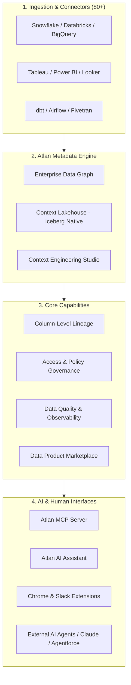

# Competitor Deep Dive: Atlan ("The Context Layer for AI")

> **Document Status**: Authoritative Market Analysis  
> **Target Tool**: Atlan (atlan.com)  
> **Primary Positioning**: "The Context Layer for AI" / Enterprise Data Graph & Context Lakehouse  
> **Target Audience**: Enterprise Data Teams, Analytics Engineers, AI/ML Engineers, Governance Officers  

---

## 1. Overview & Core Value Proposition

Atlan has evolved from a traditional data catalog into what it positions as **"The Context Layer for AI."** It aims to serve as the unified metadata graph and context supply chain that feeds metadata, business definitions, lineage, quality scores, and access policies into both human interfaces (Slack, Chrome, Web Portal) and AI agents (ChatGPT, Claude, Agentforce, Snowflake Cortex, Databricks Genie).

### Core Mission
Instead of making users navigate to a standalone catalog portal, Atlan injects metadata into where users and AI agents work. It emphasizes **"Human-in-the-loop AI"** and **"Context-as-a-Service."**

---

## 2. Core Modules & Key Capabilities



### Module Breakdown

| Module | Purpose & Functionality |
|---|---|
| **Context Lakehouse** | An Iceberg-native metadata repository storing technical schema, operational metrics, and vector embeddings for semantic search. |
| **Enterprise Data Graph** | Graph database engine mapping relationships across tables, columns, dbt models, BI dashboards, and business glossary terms. |
| **Context Engineering Studio** | Low-code environment for constructing reusable "Context Repositories" and custom metadata schemas to feed AI agents. |
| **Atlan AI Assistant** | Embedded GenAI assistant that generates table documentation, metric descriptions, dbt model docs, and automated term linkages. |
| **Atlan MCP Server** | Model Context Protocol (MCP) server enabling external AI tools (Claude Desktop, Cursor, Custom Agents) to query Atlan's metadata graph dynamically. |
| **Column-Level Lineage** | Automated end-to-end lineage parsing SQL queries, dbt manifests, and BI model files to trace field-level dependencies. |

---

## 3. Visual UI Layout & Screenshot Breakdown

To understand how Atlan looks and feels end-to-end, the following wireframes illustrate Atlan's main user interface surfaces.

### UI Surface 1: Asset Catalog & Search Interface

Atlan features a clean, faceted search interface similar to modern e-commerce sites, combining search filters on the left with rich asset details on the right.

```
+----------------------------------------------------------------------------------------------------+
|  [Search Atlan...                     ]  (Filters) (Saved Views)                  (Atlan AI [?] )  |
+------------------------------------+---------------------------------------------------------------+
| FILTERS                            | ASSETS (1,248 items found)                                    |
| ---------------------------------- | ------------------------------------------------------------- |
| Connector                          | [Table]  analytics.prod.fct_daily_transactions                  |
|  [x] Snowflake (1,100)             | Owner: @finance-team | Verification: Verified [V]             |
|  [ ] Databricks (148)              | Description: Aggregated daily transaction totals by customer   |
|                                    | Terms: [Daily Revenue] [Transaction Amount]                    |
| Asset Type                         | Quality: 99.8% Pass Rate | Rows: 45.2M | Upd: 12 mins ago        |
|  [x] Tables (450)                  | ------------------------------------------------------------- |
|  [ ] Columns (8,200)               | [dbt Model]  marts.finance.fct_orders                         |
|  [ ] BI Dashboards (120)           | Owner: @analytics-eng | Verification: Draft [?]               |
|                                    | Description: Cleaned orders table with dbt transformations     |
| Classification                     | Terms: [Order Volume]                                         |
|  [x] PII (34)                      | ------------------------------------------------------------- |
|  [ ] Confidential (89)             | [Dashboard]  Executive Financial Summary (Tableau)            |
|                                    | Owner: @cfo-office | Verification: Verified [V]               |
+------------------------------------+---------------------------------------------------------------+
```

### UI Surface 2: Column-Level Lineage Graph View

Atlan renders interactive DAGs showing source databases flowing through dbt transformations into BI Dashboards, with field-level highlights.

```
+----------------------------------------------------------------------------------------------------+
| Lineage: analytics.prod.fct_daily_transactions > Column: gross_amount                              |
+----------------------------------------------------------------------------------------------------+
|                                                                                                    |
|  +--------------------+        +-------------------------+        +-----------------------------+  |
|  | Postgres (Raw)     |        | dbt Transformation      |        | Tableau Dashboard           |  |
|  | postgres.public    |        | analytics.stg_orders    |        | Revenue Overview            |  |
|  | .raw_orders        | ------>| .order_amount           | ------>| .Total Sales Metric         |  |
|  |  - total_cents [PII]|       | (SQL: total_cents/100)  |        |                             |  |
|  +--------------------+        +-------------------------+        +-----------------------------+  |
|                                            |                                                       |
|                                            v                                                       |
|                                +-------------------------+                                         |
|                                | Snowflake Mart          |                                         |
|                                | fct_daily_transactions  |                                         |
|                                |  - gross_amount         |                                         |
|                                +-------------------------+                                         |
|                                                                                                    |
+----------------------------------------------------------------------------------------------------+
```

### UI Surface 3: Atlan AI Assistant Sidebar

Atlan embeds a slide-out AI assistant that helps data stewards auto-generate descriptions, suggest tags, and translate natural language to SQL/Context.

```
+-------------------------------------------------------------+--------------------------------------+
| ASSET DETAILS: fct_daily_transactions                       | ATLAN AI ASSISTANT                 |
| ----------------------------------------------------------- | ------------------------------------ |
| Schema: prod.finance                                        | [AI Avatar] How can I assist with    |
| Owner: Unassigned [Assign]                                  | this asset?                          |
| Description: Missing description                            |                                      |
|                                                             | Suggested Actions:                   |
| [ Auto-generate documentation with Atlan AI ]               | 1. [ Generate Asset Description ]    |
|                                                             | 2. [ Suggest Business Terms ]        |
| Columns (14):                                               | 3. [ Identify PII & Masking Rules ]  |
| - customer_id (VARCHAR) [PII Tag Suggested]                 |                                      |
| - gross_amount (DECIMAL)                                    | Prompt: Write a summary for this     |
| - tx_timestamp (TIMESTAMP)                                  | table based on dbt model lineage.    |
|                                                             | [ Send ]                             |
+-------------------------------------------------------------+--------------------------------------+
```

---

## 4. End-to-End Technical Architecture & Data Flow

```
[ Data Sources ]       [ Atlan Engine ]          [ Graph & Vector ]       [ AI Agent Layer ]
+--------------+       +------------------+       +------------------+     +--------------------+
| Snowflake    | ----> | Connector Agent  | ----> | Enterprise Data  | --> | Atlan MCP Server   |
| Databricks   |       | & Crawler        |       | Graph (Neo4j/    |     | (Context API)      |
| PostgreSQL   |       +------------------+       | Iceberg)         |     +--------------------+
| dbt Core/Cloud|               |                 +------------------+               |
| Tableau      |               v                           |                         v
+--------------+       +------------------+                v               +--------------------+
                       | SQL Lineage      |       +------------------+     | Downstream Agents  |
                       | Parser           |       | Vector Store     |     | (Claude / ChatGPT  |
                       +------------------+       | (Semantic Embed) |     |  Agentforce)       |
                                                  +------------------+     +--------------------+
```

1. **Ingestion & Extraction**: Atlan connectors periodically pull metadata, SQL logs, dbt `manifest.json` files, and BI specs.
2. **Parsing & Enrichment**: Atlan parses SQL logs to derive column-level lineage and uses Atlan AI to generate candidate documentation.
3. **Graph Storage**: Metadata is ingested into Atlan's Iceberg-native Context Lakehouse and Enterprise Data Graph.
4. **Context Provisioning**: Atlan exposes the context graph via GraphQL APIs and an MCP Server interface.
5. **Agentic Consumption**: Downstream LLM tools query Atlan for context before building or running SQL queries.

---

## 5. Competitive Assessment: Atlan vs. Our Platform (Atlas)

### Strategic Comparison Matrix

| Feature Dimension | Atlan ("Context Layer for AI") | Our Platform (Atlas / Bank Data Platform) |
|---|---|---|
| **Core Value Prop** | Context supply & catalog metadata for human/AI consumption | Governed, deterministic AI analyst platform with hard execution boundaries |
| **AI Integration Model** | Context provider (hands metadata to external LLMs/agents) | End-to-end governed AI analyst (runs models within deterministic boundaries) |
| **SQL Execution Safety** | Out-of-band (Atlan does NOT execute or govern query execution) | In-band deterministic gateway (validates, masks, inspects, and logs execution) |
| **Banking Compliance** | Documentary governance (SOC2, GDPR, catalog policy definitions) | Hard runtime enforcement (OIDC, secret-manager boundaries, BCBS 239 evidence) |
| **Maker-Checker Workflow**| Basic approval workflows for terms/glossary | Strict Maker-Checker promotion for business semantics & tool publication |
| **Connector Breadth** | 80+ enterprise connectors (Snowflake, BigQuery, Tableau, etc.) | PostgreSQL & SQL Server (Beta), dbt manifest intelligence |

### Key Atlan Weaknesses (Our Competitive Opportunities)

1. **Lack of Query Execution Boundaries**: Atlan supplies context to external agents (e.g., Claude or ChatGPT), but has **zero control over actual SQL execution** on the underlying database. Downstream agents can hallucinate or bypass rules.
2. **No Built-in In-Band Gateway**: Atlan is an out-of-band catalog, meaning it records what metadata exists, but does not intercept queries to enforce real-time row-level masking or execution budgets.
3. **High Subscription Cost & Cloud Lock-in**: Atlan is a SaaS-first platform with steep enterprise pricing, making self-hosted regulated bank deployments difficult.
