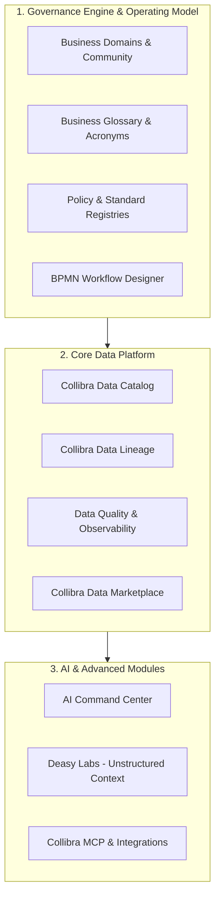

# Competitor Deep Dive: Collibra ("Enterprise AI Control Plane")

> **Document Status**: Authoritative Market Analysis  
> **Target Tool**: Collibra (collibra.com)  
> **Primary Positioning**: "Enterprise AI Control Plane" / Governance & Compliance Leader  
> **Target Audience**: Chief Data Officers (CDOs), Compliance Officers, Enterprise Data Stewards, Risk Auditors  

---

## 1. Overview & Core Value Proposition

Collibra is the traditional enterprise heavyweight and market leader in **data governance, compliance, and regulatory stewardship**. It has recently expanded its narrative to position itself as the **"Enterprise AI Control Plane."**

### Core Mission
Collibra focuses on establishing an **Enterprise Operating Model** for data assets, business metrics, policies, and AI models. It emphasizes compliance frameworks (such as BCBS 239 risk reporting, GDPR, HIPAA, and ISO 27001), automated governance workflows, and enterprise data marketplaces.

---

## 2. Core Modules & Key Capabilities



### Module Breakdown

| Module | Purpose & Functionality |
|---|---|
| **Data Governance Center** | The core operating model engine managing communities, sub-domains, business terms, roles, and policy ownership. |
| **BPMN Workflow Engine** | Customizable multi-step approval workflow engine for data access requests, glossary changes, and policy modifications. |
| **Collibra Data Marketplace** | E-commerce style portal where data consumers browse certified "Data Products", request access, and receive automated approvals. |
| **AI Command Center** | Governance dashboard for tracking AI models, generative AI applications, model risk assessments, and compliance approvals. |
| **Data Quality & Observability** | Automated rule-based quality scanning, profiling, anomaly detection, and incident tracking across enterprise databases. |
| **BCBS 239 Compliance Suite** | Built-in risk-reporting governance controls tailored specifically for tier-1 financial institutions and banking regulations. |

---

## 3. Visual UI Layout & Screenshot Breakdown

The following wireframes illustrate Collibra's key user interface screens end-to-end.

### UI Surface 1: Enterprise Operating Model & Domain Catalog View

Collibra organizes data hierarchically by Communities, Sub-Communities, and Business Domains.

```
+----------------------------------------------------------------------------------------------------+
|  Collibra Data Intelligence Platform | Community: Retail Banking > Domain: Commercial Loans       |
+------------------------------------+---------------------------------------------------------------+
| COMMUNITY HIERARCHY                | DOMAIN ASSETS: Commercial Loans Domain                        |
| ---------------------------------- | ------------------------------------------------------------- |
| [-] Enterprise Banking             | Assets (34 items)                                             |
|   [+] Wealth Management            | ------------------------------------------------------------- |
|   [-] Retail Banking               | [Business Term] Commercial Loan Exposure                      |
|     [x] Commercial Loans           | Status: Approved [V] | Steward: @j_smith | Domain: Credit Risk   |
|     [ ] Consumer Credit            | Definition: Total outstanding principal plus un-drawn line    |
|   [+] Compliance & Regulatory      | Policy: BCBS 239 Risk Materiality Standard                    |
|                                    | ------------------------------------------------------------- |
| QUICK STATS                        | [Data Set] Core_Banking.PROD.LOAN_FACILITIES                  |
| Asset Count: 14,200                | Status: Certified [V] | Quality Score: 98.5%                 |
| Unassigned Stewardship: 12%        | Sensitivity: Confidential | Lineage: 4 Upstream, 12 Downstream|
| Pending Approvals: 5               | ------------------------------------------------------------- |
|                                    | [AI Model] Credit Risk Default Classifier v2                 |
|                                    | Status: Under Review [?] | Model Risk Rating: High            |
+------------------------------------+---------------------------------------------------------------+
```

### UI Surface 2: Collibra Data Marketplace & Access Request Flow

Users select certified data products, add them to a shopping cart, and initiate automated BPMN workflow approvals.

```
+----------------------------------------------------------------------------------------------------+
| DATA MARKETPLACE  | Shopping Cart (1 item)                                        [ Submit Request ]|
+----------------------------------------------------------------------------------------------------+
| SEARCH & CATEGORIES                | RECOMMENDED DATA PRODUCTS                                     |
| ---------------------------------- | ------------------------------------------------------------- |
| [ Search Data Marketplace...     ] | [ Data Product ] Customer 360 Analytical Feed                  |
|                                    | Category: Customer Insights | Rating: 4.8 / 5               |
| Categories                         | Includes: Customer Profile, Credit Tier, Churn Propensity    |
|  [x] Finance & Accounting          | SLA: Daily 06:00 UTC | Compliance: GDPR Compliant [V]        |
|  [ ] Risk & Regulatory             | [ + Add to Cart ]  [ View Data Contract ]                     |
|  [ ] Marketing Analytics           | ------------------------------------------------------------- |
|                                    | ACCESS APPROVAL WORKFLOW STEPS:                               |
| Access Level                       | 1. Business Owner Approval (@m_johnson)                       |
|  [x] Read-Only                     | 2. Data Privacy Officer Review (Automatic for PII)            |
|  [ ] Write / Modify                | 3. Snowflake Role Provisioning (Automated Script Execution)   |
+------------------------------------+---------------------------------------------------------------+
```

### UI Surface 3: AI Command Center & AI Asset Governance

Collibra tracks AI models alongside data assets, logging risk ratings, training data lineage, and model cards.

```
+----------------------------------------------------------------------------------------------------+
| AI COMMAND CENTER | AI Asset: Customer Churn Predictor (v3.1)                                     |
+----------------------------------------------------------------------------------------------------+
| GOVERNANCE OVERVIEW                | RISK ASSESSMENT & COMPLIANCE SUMMARY                          |
| ---------------------------------- | ------------------------------------------------------------- |
| Asset Type: Generative AI Agent    | Model Risk Level: HIGH (EU AI Act Category II)                |
| Model Vendor: Azure OpenAI GPT-4   | Compliance Checks:                                            |
| Business Owner: @marketing_vp      |  [V] Model Card Approved by AI Ethics Board                   |
| Technical Lead: @data_science_lead |  [V] Training Data Lineage Verified (No PII leakage)          |
|                                    |  [!] Bias & Fairness Audit Pending Approval                  |
| Associated Data Contracts:         | ------------------------------------------------------------- |
| - Customer_360_Feed_v1             | DECISION WORKFLOW:                                            |
| - Marketing_Interactions_v2        | Action: [ Approve Model Deployment ]  [ Reject / Flag Risk ]  |
+------------------------------------+---------------------------------------------------------------+
```

---

## 4. End-to-End Technical Architecture & Data Flow

```
[ External Infrastructure ]   [ Collibra Engine ]      [ Governance & Workflows ]    [ Consumer Layer ]
+-------------------------+   +-------------------+    +------------------------+    +------------------+
| Databases & Warehouses  |   | Data Catalog      | -> | Enterprise Operating   | -> | Collibra Data    |
| (Oracle, DB2, Snowflake)|   | Ingestion         |    | Model (Communities)    |    | Marketplace      |
+-------------------------+   +-------------------+    +------------------------+    +------------------+
             |                          |                          |                          |
             v                          v                          v                          v
+-------------------------+   +-------------------+    +------------------------+    +------------------+
| Enterprise Applications |   | Deep Lineage      |    | BPMN 2.0 Workflow      |    | AI Command Center|
| (SAP, Salesforce)       |   | Extractor         |    | Engine (Approvals)     |    | & Compliance APIs|
+-------------------------+   +-------------------+    +------------------------+    +------------------+
```

---

## 5. Competitive Assessment: Collibra vs. Our Platform (Atlas)

### Strategic Comparison Matrix

| Feature Dimension | Collibra ("Enterprise AI Control Plane") | Our Platform (Atlas / Bank Data Platform) |
|---|---|---|
| **Primary Focus** | Top-down enterprise governance, stewardship, & BCBS 239 risk compliance | Bottom-up governed execution, live AI analyst, and deterministic runtime boundaries |
| **AI Execution Governance**| Model registration & policy documentation (out-of-path) | In-path SQL execution gateway, prompt risk screening, & auditable query trace |
| **Setup & Complexity** | Very high (requires dedicated consulting teams and months of ontology setup) | Fast deployment, single container/Docker compose quickstart |
| **Marketplace & Access** | Full enterprise Data Product marketplace with custom workflow engine | Governed metadata retrieval, approved tool catalog, & maker-checker tool drafting |
| **In-Path SQL Guardrails** | None (Collibra relies on database GRANTs or external policy engines) | Hard deterministic SQL validation, SQL parser, & value-free query lineage |

### Key Collibra Weaknesses (Our Competitive Opportunities)

1. **High Complexity & Slow Time-to-Value**: Collibra projects often take 6–18 months to configure due to rigid ontology definitions and heavy BPMN workflow setup.
2. **Out-of-Path Governance**: Collibra acts as a "book of record" for policies and approvals, but **does not intercept queries at execution time**. It cannot block a bad or risky query from running live against a database.
3. **Legacy UI & High Cost**: Traditional enterprise governance UI can feel heavy and disconnected from modern analyst workflows (dbt, SQL notebooks, inline AI chats).
4. **Lineage harvester reliability** *(independent-review corroboration, added 2026-08-30)*: the vendor-page scoring in `00-product/04-competitive-feature-matrix.md` §3 rates Collibra `●` on most lineage rows — that reflects Collibra's *stated* capability, per this repo's sourcing policy (see `90-reference/03-sources.md`). Independent practitioner sources tell a different story at the point of use: Collibra's Lineage Harvester has user-reported performance and accuracy problems, and the interface is called out as comparatively complex against Atlan's — even though Collibra edges Atlan on G2's lineage-visualization score (8.0 vs 7.3). Net effect: the matrix likely *understates* how much of a real differentiator Atlas's unified lineage graph (`unified_lineage_api.py`, see `08-collibra-lineage-and-platform-analysis-2026-08.md`) already is on trustworthiness and ease of use, not just on the merged-graph feature checklist. Treat this as a messaging point (lead with "lineage you can trust," not just "lineage you have"), not a rescore — a single-author account is not a benchmark. Sources: `90-reference/03-sources.md` → "Independent practitioner reviews."
