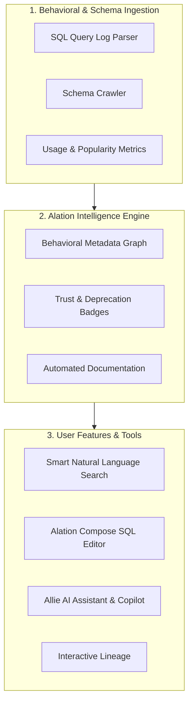

# Competitor Deep Dive: Alation ("Agentic Data Intelligence Platform")

> **Document Status**: Authoritative Market Analysis  
> **Target Tool**: Alation (alation.com)  
> **Primary Positioning**: "Agentic Data Intelligence Platform"  
> **Target Audience**: Data Analysts, Data Engineers, Analytics Managers, Data Stewards  

---

## 1. Overview & Core Value Proposition

Alation was a pioneer in the data catalog space, popularizing **behavioral metadata extraction** (parsing query logs to determine which tables and join paths are actually popular). It has recently rebranded as the **"Agentic Data Intelligence Platform,"** putting its AI assistant **Allie AI** at the center of data search, documentation, and query generation.

### Core Mission
Alation aims to empower data analysts and business users to find, trust, and analyze data quickly. Its key differentiator has historically been **query log intelligence** (understanding user behavior through SQL logs) combined with an integrated SQL editor (**Alation Compose**).

---

## 2. Core Modules & Key Capabilities



### Module Breakdown

| Module | Purpose & Functionality |
|---|---|
| **Behavioral Metadata Engine** | Analyzes database query logs to calculate table popularity, frequent join patterns, top query authors, and candidate business terms. |
| **Allie AI** | Embedded generative AI copilot that assists with catalog search, metadata generation, SQL autocomplete, and query explanation. |
| **Alation Compose** | Cloud-native SQL editor built directly into the catalog, providing intelligent schema lookup, join recommendations, and real-time governance warnings. |
| **Trust Flags & Endorsements** | Visual indicators showing whether an asset is "Endorsed", "Deprecating", or "Warning" based on steward reviews. |
| **Data Health & Lineage** | Tracks column-level lineage and displays integrated data quality scores from partners (e.g. Monte Carlo, Anomalo, Soda). |

---

## 3. Visual UI Layout & Screenshot Breakdown

The following wireframes illustrate Alation's core analyst-facing user interface surfaces.

### UI Surface 1: Smart Search & Behavioral Asset Ranking View

Alation ranks search results based on actual query popularity and steward endorsements.

```
+----------------------------------------------------------------------------------------------------+
| Alation Data Catalog | [ Search data assets, SQL queries, or terms...               ] [ Search ]   |
+------------------------------------+---------------------------------------------------------------+
| FILTERS                            | SEARCH RESULTS (Ranked by Usage & Trust)                      |
| ---------------------------------- | ------------------------------------------------------------- |
| Asset Type                         | [TABLE] analytics.dw.fact_monthly_financials                  |
|  [x] Tables (120)                  | Badge: [ENDORSED BY @cfo_office] | Usage: Top 1% (4,520 queries) |
|  [ ] Queries (450)                 | Description: Core financial balances reconciled monthly        |
|  [ ] Terms (85)                    | Frequent Users: @analyst_jane, @data_bob                      |
|                                    | Top Join: INNER JOIN dim_customer ON customer_id               |
| Steward Endorsement                | ------------------------------------------------------------- |
|  [x] Endorsed Only                 | [QUERY] "Quarterly Revenue Breakdown by Region"              |
|  [ ] Deprecated Excluded           | Author: @analyst_jane | Usage: Executed 142 times              |
|                                    | SQL Snippet: SELECT region, SUM(revenue) FROM fact_sales...   |
+------------------------------------+---------------------------------------------------------------+
```

### UI Surface 2: Alation Compose SQL Editor with Allie AI

Alation Compose combines a live SQL IDE with catalog context, join recommendations, and governance policy warnings inline.

```
+----------------------------------------------------------------------------------------------------+
| ALATION COMPOSE | File: monthly_revenue_report.sql                        [ Run Query ] [ Save ]    |
+----------------------------------+-----------------------------------------------------------------+
| SCHEMA BROWSER                   | SQL EDITOR                                                      |
| -------------------------------- | --------------------------------------------------------------- |
| [-] dw_finance                   | 1 | SELECT                                                      |
|   [-] tables                     | 2 |     c.customer_name,                                            |
|     [x] fact_sales               | 3 |     SUM(s.amount) AS total_spent                                |
|     [ ] dim_customer             | 4 | FROM dw_finance.fact_sales s                                    |
|                                  | 5 | JOIN dw_finance.dim_customer c ON s.cust_id = c.cust_id         |
| RECOMMENDED JOINS                | 6 | WHERE s.tx_date >= '2026-01-01'                                 |
| s.cust_id = c.cust_id (98% match)| 7 | GROUP BY 1;                                                     |
| s.store_id = r.store_id (85%)    | --------------------------------------------------------------- |
|                                  | ALLIE AI ASSISTANT & GOVERNANCE WARNINGS                        |
|                                  | [!] WARNING: `fact_sales` contains PII columns (customer_name). |
|                                  | [Allie AI]: Would you like to auto-apply masking functions?      |
+----------------------------------+-----------------------------------------------------------------+
```

---

## 4. Technical Architecture & End-to-End Data Flow

```
[ Target Warehouses ]     [ Log Extraction ]       [ Behavioral Index ]     [ Alation User UI ]
+-------------------+     +------------------+     +--------------------+   +-------------------+
| Snowflake / Redshift| ->| Query Log        | ->  | Usage & Join       | ->| Catalog Search &  |
| BigQuery / Postgres|    | Crawler          |     | Popularity Engine  |   | Asset Explorer    |
+-------------------+     +------------------+     +--------------------+   +-------------------+
                                   |                         |                        |
                                   v                         v                        v
                          +------------------+     +--------------------+   +-------------------+
                          | Schema & DDL     |     | Allie AI Vector    |   | Alation Compose   |
                          | Inspector        |     | Search Engine      |   | SQL Workspace     |
                          +------------------+     +--------------------+   +-------------------+
```

---

## 5. Competitive Assessment: Alation vs. Our Platform (Atlas)

### Strategic Comparison Matrix

| Feature Dimension | Alation ("Agentic Data Intelligence") | Our Platform (Atlas / Bank Data Platform) |
|---|---|---|
| **Core Value Prop** | Behavioral intelligence, analyst search, & SQL query building | Governed AI analyst execution, deterministic boundaries, & bank-grade audit |
| **Query Log Usage** | High (uses log popularity to rank search & recommend joins) | Selective (uses query history for deterministic lineage & query memory) |
| **SQL Execution** | User-facing SQL Editor (Compose) executing directly on database | Gateway execution pipeline with prompt screening, SQL validation, & masking |
| **AI Capabilities** | Allie AI copilot for search, SQL generation, & doc writing | Autonomous AI Analyst agent executing multi-step investigation plans |
| **Maker-Checker Control**| Basic approval badges ("Endorsed", "Deprecated") | Formal Maker-Checker review for business semantic promotion & draft tool publishing |

### Key Alation Weaknesses (Our Competitive Opportunities)

1. **Focus on Human Analysts Over Autonomous AI**: While Alation has introduced Allie AI, its UI is primarily designed for human analysts writing SQL in Compose, rather than autonomous agentic workflows with strict safety bounds.
2. **No Deterministic Execution Interception**: Alation Compose sends SQL directly to the target warehouse user connection; it lacks an internal deterministic gatekeeper that enforces query rewrite rules or execution budgets before database hit.
3. **Connector Complexity**: Connector setup and query log ingestion across legacy enterprise databases can require heavy maintenance and database permissions.
