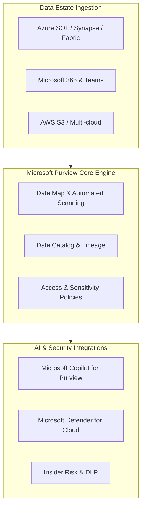
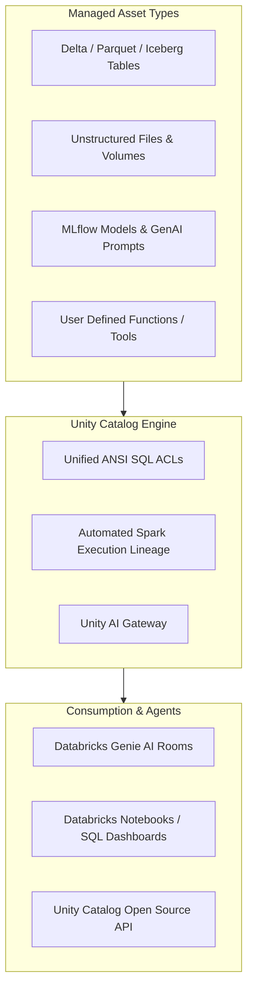

# Competitor Deep Dive: Cloud Catalogs (Microsoft Purview & Databricks Unity Catalog)

> **Document Status**: Authoritative Market Analysis  
> **Target Tools**: Microsoft Purview & Databricks Unity Catalog  
> **Primary Positioning**: Cloud-Native Enterprise Data Governance & Lakehouse Context Planes  
> **Target Audience**: Azure Architecture Teams, Databricks Lakehouse Engineers, Cloud Security Officers  

---

## 1. Overview & Cloud Ecosystem Positioning

While independent catalog platforms (Atlan, Collibra, Alation) attempt to remain multi-cloud neutral, cloud hyper-scalers have built deeply integrated governance layers:

1. **Microsoft Purview**: Microsoft's unified data governance, risk management, and compliance suite across Azure, Microsoft 365, and multi-cloud data estates.
2. **Databricks Unity Catalog**: The unified governance layer for data and AI assets across the Databricks Intelligence Platform, now available open-source.

---

## 2. Microsoft Purview Breakdown



### Key Capabilities & UI Wireframe

- **Automated Data Scanning**: Scans databases and files for over 200+ built-in sensitive classification patterns (SSN, Credit Card, Bank Account numbers).
- **Sensitivity Labels**: Integrates directly with Microsoft Information Protection (MIP) sensitivity labels across Excel, Word, Power BI, and Azure SQL.
- **Purview Copilot**: Natural language interaction for security policies, sensitive asset discovery, and compliance investigations.

```
+----------------------------------------------------------------------------------------------------+
| Microsoft Purview Governance Portal | Data Estate Insights & Sensitive Asset Map                   |
+------------------------------------+---------------------------------------------------------------+
| NAVIGATION                         | ASSET CLASSIFICATION BREAKDOWN                                 |
| ---------------------------------- | ------------------------------------------------------------- |
| [x] Data Map                       | Total Scanned Files: 4.2M | Sensitive Assets Found: 1,420     |
| [ ] Data Catalog                   | ------------------------------------------------------------- |
| [ ] Data Estate Insights           | Top Sensitive Classifications:                                |
| [ ] Compliance Manager             | 1. Credit Card Numbers (MIP Label: Highly Confidential)       |
|                                    | 2. EU National ID Numbers (MIP Label: Restricted)            |
| ASSET SOURCES                      | 3. Bank Account Numbers (MIP Label: Confidential)             |
| - Azure Data Lake Storage (Gen2)   | ------------------------------------------------------------- |
| - Azure SQL Database               | RECENT DATA LINEAGE ALERTS                                     |
| - Power BI Tenant                  | [!] Unencrypted PII flow detected: ADLS -> Synapse Workspace  |
+------------------------------------+---------------------------------------------------------------+
```

---

## 3. Databricks Unity Catalog Breakdown



### Key Capabilities & UI Wireframe

- **Unified Governance for Data & AI**: Governs tables, volumes, MLflow models, and registered AI tools in a single three-tier namespace (`catalog.schema.asset`).
- **Automated Lineage**: Captures runtime column-level lineage automatically at the Spark/Delta execution level without manual parser configuration.
- **Unity AI Gateway**: Provides centralized API rate limiting, LLM route management, and credential guardrails for GenAI applications within Databricks.
- **Databricks Genie**: Natural-language conversational interface over Unity Catalog assets.

```
+----------------------------------------------------------------------------------------------------+
| Databricks Catalog Explorer | Namespace: main.finance_mart.fct_daily_revenue                       |
+------------------------------------+---------------------------------------------------------------+
| CATALOG BROWSER                    | ASSET OVERVIEW: main.finance_mart.fct_daily_revenue           |
| ---------------------------------- | ------------------------------------------------------------- |
| [-] main (Catalog)                 | Schema Type: Managed Delta Table | Format: Delta Lake          |
|   [-] finance_mart                 | Owner: `finance_admins` | Storage Location: s3://bank-lake/  |
|     [x] fct_daily_revenue          | ------------------------------------------------------------- |
|     [ ] dim_customers              | COLUMNS (6):                                                  |
|     [ ] credit_risk_model (ML Model| - transaction_id (STRING) [PRIMARY KEY]                       |
|   [+] risk_mart                    | - amount (DECIMAL) [TAG: Financial_Metric]                    |
|                                    | - customer_ssn (STRING) [TAG: PII, MASKED BY ROW FILTER]      |
| ACCESS PERMISSIONS                 | ------------------------------------------------------------- |
| Grantee: `analyst_role`            | AUTOMATED SPARK LINEAGE                                       |
| Privileges: SELECT                 | Upstream Jobs: `job_daily_etl_12` -> Source: `raw.orders`    |
+------------------------------------+---------------------------------------------------------------+
```

---

## 4. Comprehensive Comparison Matrix: Cloud Catalogs vs. Our Platform (Atlas)

| Feature Dimension | Microsoft Purview | Databricks Unity Catalog | Our Platform (Atlas / Bank Data Platform) |
|---|---|---|---|
| **Ecosystem Ecosystem Focus**| Azure & M365 Ecosystem | Databricks Lakehouse Ecosystem | Heterogeneous Enterprise Databases (Postgres, SQL Server, Oracle, BigQuery) |
| **Governance Approach**| Top-down compliance & MIP labeling | Storage & Spark compute ACL layer | Governed query execution gateway & deterministic tool execution |
| **Lineage Capture** | Scanner-based & API extraction | Native Spark engine execution trace | Value-free SQL query parser & dbt manifest intelligence |
| **AI Integration** | Microsoft Copilot for Purview | Unity AI Gateway & Databricks Genie | Deterministic AI analyst agent with fail-closed model routes & Maker-Checker review |
| **On-Prem / Multi-Cloud**| Cloud-dependent (Azure native) | Cloud-dependent (AWS/Azure/GCP) | Portable self-hosted Docker / Kubernetes deployment for regulated banks |

---

## 5. Strategic Takeaway for Our Platform

1. **Purview & Unity Catalog are Cloud-Siloed**: Purview excels inside Microsoft Azure; Unity Catalog excels inside Databricks. Regulated banks operate across hybrid infrastructure (on-prem Mainframe/Oracle + multi-cloud Snowflake/Postgres).
2. **Opportunity for Atlas**: Position our platform as the **bank-grade, multi-database governed AI analyst gateway** that bridges heterogeneous databases outside a single cloud ecosystem.
