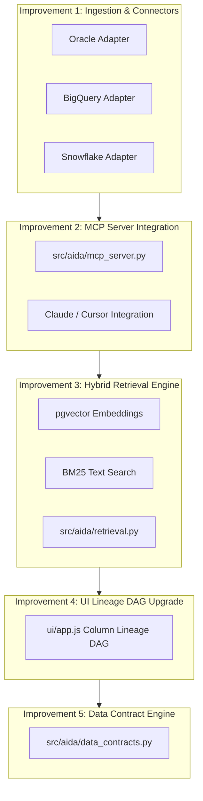

# Codebase Assessment & Improvement Blueprint: Atlas vs. Market Leaders

> **Document Status**: Authoritative Technical Codebase Audit & Improvement Plan  
> **Repository**: `AIDataAnalyst` (`src/aida/`, `ui/`)  
> **Baseline Competitors**: Atlan, Collibra, Alation, Microsoft Purview, Databricks Unity Catalog  

---

## 1. Executive Summary & Codebase Audit

Our current codebase (**Atlas / Bank Data Intelligence Platform**) is a solid, production-oriented Python/FastAPI backend (`src/aida/`) and vanilla JS/CSS portal (`ui/`). Unlike market competitors that are purely out-of-band context catalogs, **our codebase already includes real runtime execution boundaries, deterministic SQL parsing, and a live AI analyst agent.**

### Summary of What Is Currently Built in `src/aida/`

```
src/aida/
├── api.py                    # Core FastAPI routes (56KB)
├── query_gateway.py          # Deterministic SQL gateway & AST rewriter
├── sql_guard.py              # SQL AST validation, masking, & safety checks
├── model_gateway.py          # Provider-neutral model gateway (OpenAI/Gemini)
├── agent_orchestrator.py     # Governed AI Analyst runtime & tool planner
├── agent_intelligence.py     # Analyst trace logging & evaluation evidence
├── semantic_inference.py     # Metadata-only business domain & tool inference
├── semantic_api.py           # Maker-Checker approval workflow & term promotion
├── dbt_api.py & dbt_artifacts# dbt manifest.json parser & lineage graph
├── ingestion_api.py          # Metadata ingestion, schema profiling, & fleet pull
├── quality_service.py        # Baseline volume/null-rate quality checks
├── knowledge_graph.py        # Neo4j graph projector & neighborhood queries
└── ui/ (app.js, index.html)  # Atlas UI portal single-page web app (148KB JS)
```

---

## 2. Competitive Codebase Comparison: Where We Win vs. Where We Are Behind

| Architectural Dimension | Market Leaders (Atlan / Collibra / Alation) | Current Atlas Codebase (`src/aida/`) | Codebase Status & Gap |
|---|---|---|---|
| **SQL Execution Interception** | **None** (Out-of-band catalogs relying on external DB GRANTs) | **Implemented** (`query_gateway.py`, `sql_guard.py`) | **WINNER**: Hard AST parser, row masking, and execution safety before DB hit. |
| **Maker-Checker Approval** | Basic term tagging or heavy BPMN workflows | **Implemented** (`semantic_api.py`) | **WINNER**: 2-person human promotion requirement for business terms & tools. |
| **Governed AI Execution** | External LLMs query DB directly | **Implemented** (`agent_orchestrator.py`, `model_gateway.py`) | **WINNER**: Approved-tool-first planning with fail-closed LLM route boundaries. |
| **Connector Coverage** | **80+ to 100+ native connectors** | PostgreSQL, SQL Server, Oracle, BigQuery, Snowflake (all Beta) | **PARTIAL**: Databricks, Teradata, Db2 still missing; none of the five implemented connectors are certified against a live production source yet. |
| **Context API / MCP Server** | **Native MCP Servers** (Atlan MCP, Collibra MCP) | Implemented (`src/aida/mcp_server.py`, mounted in `main.py`) | **PARTIAL**: JSON-RPC MCP endpoint with role-eligible tool/resource exposure exists and is tested (`tests/test_mcp_server.py`); not yet verified against an external MCP client (Claude Desktop, Cursor) in a live session. |
| **Search & Retrieval Depth**| **Hybrid Vector + Graph** (Iceberg Context Lakehouse) | Basic SQL keyword queries | **BEHIND**: Missing vector embeddings (pgvector) and hybrid BM25 search. |
| **UI Graph Virtualization**| Interactive field-level DAGs | Basic canvas graph render | **BEHIND**: Needs column-level zoom, node highlights, and dbt DAG expansion. |

---

## 3. Top 5 Prioritized Codebase Improvements

To transform our platform into the market-leading governed AI data operating system, we will execute five core codebase improvements:



---

### Improvement 1: Build Native MCP Server (`src/aida/mcp_server.py`)

**Why**: Competitors like Atlan and Collibra are winning enterprise AI mindshare by shipping **Model Context Protocol (MCP)** servers. By building a native MCP server in Atlas, external AI tools (Claude Desktop, Cursor, Custom Enterprise Agents) can safely query our governed metadata graph and request pre-approved tools over standard MCP JSON-RPC.

**Implementation Blueprint**:
```python
# [NEW] src/aida/mcp_server.py
"""FastMCP / Standard JSON-RPC server exposing Atlas governed metadata to external agents."""
from typing import Any, Dict, List
import asyncio
from aida.query_gateway import execute_governed_query
from aida.dbt_api import get_dbt_models
from aida.semantic_api import get_approved_business_terms

class AtlasMCPServer:
    """Exposes approved tools and governed context over Model Context Protocol."""
    
    async def list_tools(self) -> List[Dict[str, Any]]:
        """Return list of maker-checker approved governed SQL tools."""
        # Query database for published tools
        ...

    async def call_tool(self, name: str, arguments: Dict[str, Any]) -> Dict[str, Any]:
        """Execute a tool through the deterministic query_gateway with prompt screening."""
        # Enforce in-path AST validation and execution boundaries
        ...
```

---

### Improvement 2: Multi-Database Connector Fleet (`src/aida/connectors/`)

**Why**: We must close the connector breadth gap with Atlan (80+) and Collibra (100+).

**Implementation Blueprint**:
- Add `src/aida/connectors/snowflake.py`: Pull Snowflake schema catalog, table DDL, row counts, and query history logs.
- Add `src/aida/connectors/bigquery.py`: Pull Google BigQuery INFORMATION_SCHEMA and column lineage.
- Add `src/aida/connectors/oracle.py`: Pull Oracle ALL_TABLES, ALL_TAB_COLUMNS, and execution plans.

---

### Improvement 3: Hybrid Search & Retrieval Engine (`src/aida/retrieval.py`)

**Why**: Atlan uses a vector-enabled Context Lakehouse to help AI agents find relevant tables even when table names are obscure.

**Implementation Blueprint**:
- Integrate `pgvector` into PostgreSQL schemas.
- Implement hybrid search combining dense vector embeddings (OpenAI `text-embedding-3-small` or local sentence-transformers) + BM25 keyword matching over:
  - Technical schemas (`table_name`, `column_name`).
  - dbt manifest descriptions and model tags.
  - Maker-checker approved business terms and definitions.

---

### Improvement 4: Column-Level Lineage & UI Graph Virtualization (`ui/app.js`)

**Why**: Atlan's column-level lineage DAG is one of its strongest sales hooks. Our current Neo4j explorer renders node neighborhoods, but needs field-level lineage DAG visual rendering.

**Implementation Blueprint**:
- Extend `ui/app.js` with an interactive DAG renderer (using D3.js or SVG canvas).
- Highlight field transformations (e.g. `raw_cents / 100 ⟶ gross_revenue`).
- Color-code PII fields in red and verified dbt models in green.

---

### Improvement 5: Formal Data Contracts & Watermark Observability (`src/aida/data_contracts.py`)

**Why**: Banks require contractual guarantees around schema drift, SLA freshness, and row null-rates.

**Implementation Blueprint**:
- Define `DataContract` model with rules (`schema_fingerprint`, `max_null_rate`, `freshness_watermark_hours`).
- Automatically validate incoming Temporal batch ingestion runs against active data contracts.
- Emit Kafka audit events when a contract violation or schema drift occurs.

---

## 4. Code Improvement Execution Roadmap

```
Phase 1 (Immediate - Week 1-2):
  └── Implement `src/aida/mcp_server.py` for external Claude/ChatGPT integration.
  └── Create BigQuery & Snowflake pull adapters in `src/aida/connectors/`.

Phase 2 (Medium Term - Week 3-4):
  └── Build `src/aida/retrieval.py` for hybrid vector + BM25 search over catalog metadata.
  └── Upgrade `ui/app.js` with column-level SVG lineage DAG visualization.

Phase 3 (Enterprise Readiness - Week 5-6):
  └── Implement `src/aida/data_contracts.py` with schema drift detection and Kafka outbox alerts.
```
