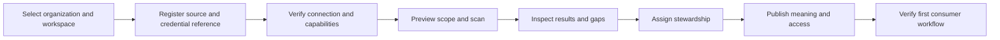

# Atlas — screens, sequencing, and user experience

Companion to [the engineering review](REVIEW.md). This document describes the review baseline and proposed product direction. Consult the [existing remediation tracker](POINTS-TRACKER.md) for subsequent implementation activity. Recommendations are based on screen source, component structure, navigation, and API calls. A live visual/accessibility certification was not possible in the review environment.

## 1. One understandable application story

The user should experience a connected process:

> Find data I can use. Understand its meaning and trustworthiness. Ask or build something useful. Get the necessary decisions. See what changed and what needs attention.

For a new source:

> Connect it. See what arrived. Fix the important gaps. Publish governed meaning and access. Help someone consume it. Keep it healthy.

The application already has persona grouping, onboarding, evidence panes, cross-links, versioning, and supervision. Improve their continuity before adding another independent dashboard.

### Four questions every screen should answer

1. **Where am I?** Organization, workspace, source/product, object, lifecycle state.
2. **Why am I here?** The task, issue, or question that opened this view.
3. **What can I do now?** One primary action with clear prerequisites and permissions.
4. **What happens next?** Outcome, next owner/approval, and a link carrying context.

After submitting a description: “Submitted for review. The current published description remains in use. Track this proposal in Reviews.” After approval: “Published version 3. View the updated asset and affected products.” This communicates the product's governance without requiring knowledge of backend modules.

## 2. Navigation rearrangement

The baseline has 40 routes under eight workbench headings, with the current group's pages repeated horizontally. Steward and Operator still have many choices, and several destinations overlap conceptually.

| Main area | User task | Existing capabilities |
|---|---|---|
| **My work** | Choose the next task and resume work | Overview, Agent inbox, assigned reviews and documentation shortcuts |
| **Discover** | Find and understand usable data | Catalog, Marketplace, Business meaning, Lineage, Portfolio analytics |
| **Analyze & build** | Ask a question or create governed assets | Ask Atlas, Semantics, Tools, Tool plans, Context products, Agent gateway, Studio |
| **Improve data** | Resolve meaning, ownership, and quality gaps | Stewardship, Worklist, Drafts, Relationships, Cross-source, Quality, Playbooks, Suppressed suggestions |
| **Review & evidence** | Decide and substantiate outcomes | Review queue, Parsed lineage review, Policy refusals, Audit, Compliance packs |
| **Operate & administer** | Keep integrations, AI, access, and delivery healthy | Sources, Operations, Transformations, Reliability, AI administration, Access, Delegations, Administration |

These are work areas, not new authorization roles. Offer favorites and assigned work based on actual responsibilities. Keep a searchable all-pages directory for experts. Preserve existing route aliases when moving navigation entries.

### Consolidations

- **Lineage / Unified lineage / Cross-source:** one investigation workspace with Narrated, Graph, Impact, and Cross-source modes. Keep approval tasks distinct from viewing relationships.
- **AI registry / Agent roster / AI governance / Reviewer agent:** one administration area with Inventory, Runtime, Models, Evaluations, and Supervision tabs.
- **Stewardship / Documentation worklist / Description drafts:** one workbench with Prioritized work, My drafts, Ownership, and Bulk actions.
- **Review queue / Parsed lineage review:** common reviewer landing and evidence/decision shell, retaining specialized evidence and edge-type rules.
- **Operations / Reliability:** a shared operations landing with Runs, Delivery, Incidents, SLOs, and Audit archive.
- **Workspace access / Access policies / Delegations:** one access area with separate membership, bindings, policies, and temporary-authority workflows.

Consolidate context/navigation and shared components. Do not merge all code into even larger screens.

## 3. Screen arrangement and interaction contract

```text
Organization / Workspace / Source or Product         Session + data mode

Task title                                           Primary action
Purpose, current state, last updated                  Secondary actions

Search + task filters + saved view

List / results / graph                      Selected object
                                            Summary | Evidence | History
                                            Why it matters
                                            Change / impact / decision

Background task progress or receipt          Next step + responsible owner
```

Use drawers for inspection and full-screen editors for long authoring. Preserve list filters on close. Keep raw IDs, SQL, JSON, and architecture labels in an expert/evidence section unless they help the immediate decision.

Separate state families:

| Family | States and meaning |
|---|---|
| Content | Draft → Submitted → Approved/Rejected → Published → Superseded/Withdrawn |
| Execution | Queued → Running → Completed/Failed/Cancelled, with retryability |
| Delivery | Pending → Attempted → Delivered/Failed, with destination receipt |
| Authorization | Allowed / Denied / Needs access / Undetermined, with safe reason |
| Data | Freshness configured/unconfigured, quality known/unknown, certification current/expired |

Do not make configured, approved, active, and healthy synonyms. Do not convert unknown into zero.

## 4. All 40 navigation routes

The filenames below are under `ui-next/src/screens/`. “Existing” means present in the inspected baseline, not production-certified. Proposed improvements may reuse backend functionality already present. Confirm subsequent tracker changes before implementing again.

| Route / screen | Existing capability | Recommended improvement | Completion condition |
|---|---|---|---|
| `home` · HomeScreen | Catalog sample, source/review counts, recent assets, attention cards, onboarding | Lead with next assigned task and resumable work. Use aggregate estate counts; disclose denominator/scope for sampled trust. Show unavailable signals as unknown. | New users see the correct first step; returning users resume work; failed counts never look healthy. |
| `inbox` · AgentInboxScreen | Proposals, auto-applied activity, agents and kill controls | Combine human and agent tasks with priority, due time, affected assets, and reason. Separate supervision controls from routine work. Preserve exact proposal context. | A supervisor inspects, decides, and sees the outcome without searching multiple menus. |
| `analyst` · AskScreen | Questions, history, explanations, SQL/execution metadata, trust/grounding receipts | Add the bounded result table, answer summary/units, suitable charts, follow-ups, and prerequisite guidance. Reveal evidence progressively; distinguish old evidence from a current-policy rerun. | Users see the actual approved answer, understand its limitations, and can safely repeat it. |
| `catalog` · CatalogScreen | Virtualized assets, filters, evidence, bulk description/certification handoffs | Persistent identity/breadcrumb; saved views; explicit cross-page selection semantics; unified asset workspace. Rank attention only when requested. | Search → inspect → trust → analyze/review retains asset and scope. |
| `semantics` · SemanticsScreen | Model/metric versions, authoring integration and consumers | Bring definition, formula, grain, dimensions, units, time semantics, owner, lifecycle together. Show conflicting definitions and affected consumers before publication. | Users know which published metric their answer uses and why similarly named metrics differ. |
| `tools` · ToolRegistryScreen | Governed tools, versions, parameter designer, submit/execute | Separate Browse/Use from Author. Consumers get readable parameter forms; authors get examples, validation, budgets, dependencies, and diffs. Keep SQL expert-oriented. | Consumers run published tools; authors submit and track versions without confusing execution and publication. |
| `tool-plans` · ToolPlansScreen | Multi-step plan creation, validation, execution, cancel, evidence | Visualize step dependencies and input/output mapping, combined budget, failure policy, current checkpoint, and rerun scope. Guard duplicate execution. | Users predict execution and understand partial completion/failure. |
| `lineage` · NarratedLineageScreen | Search and explained lineage/impact | Start with origin, change impact, or blockage questions. Attach each narrative step to actual evidence and graph highlight. | Every explanation is traceable; unknown/withheld relationships remain explicit. |
| `unified-lineage` · UnifiedLineageScreen | Layered graph, domain/source scope, zoom, impact, grant handoff | Make this Graph mode in the lineage workspace. Separate neighborhoods from estate topology; show bounds, scope, hidden layers, legend; offer tabular paths. | Users never mistake a bounded graph for the complete estate. |
| `marketplace` · MarketplaceScreen | Product browsing and access requests | Lead with purpose, owner, quality/freshness, contract, consumption method. Separate approval from provisioning status. Add useful facets, subscriptions, comparisons, recent use. | Request → decision → usable access can be followed to completion. |
| `portfolio-analytics` · PortfolioAnalyticsScreen | Product lifecycle, access, usage, quality trends/ranking | Place in product-owner workspace. Define metric/window/denominator/scope; drill counts into contributing records and actions. | Owners act on unhealthy, underused, or costly products rather than only see charts. |
| `context` · ContextProductsScreen | Creation/versioning, compiler, bindings and publication | Sequence audience → governed content → contract preview → validate → review → publish → bind → observe. Explain compatibility and policy/version constraints. | Developers understand exactly what context consumers receive and can trace each release. |
| `developer` · AgentGatewayScreen | MCP details, exposure, contract requests and consumption | Fix production endpoint. Add authenticated diagnostics and explicit client profiles. Distinguish the viewing human's preview from actual agent identity exposure. | Copied configuration connects; registration completes; first allowed/refused call is visible. |
| `stewardship` · StewardshipScreen | Bulk tag/classify/own/certify, unowned routing | Lead with impact/risk priority; add batch preview, reason, review requirements, partial-success receipt. Integrate owner expiry into tasks. | Stewards know what matters and can prove what each batch changed. |
| `worklist` · DocumentationWorklistScreen | Ranked documentation tasks | Explain ranking; add assignment/defer and progress. Open editor with evidence; offer next task after submit. | Users complete a series of valuable tasks without repeatedly finding assets. |
| `description-drafts` · DescriptionDraftsScreen | Generated drafts and submission | Current/proposed comparison, evidence, edit history, validation, per-item batch submission outcomes, unsaved-edit protection. | Drafts can be improved and tracked without being mistaken for published truth. |
| `meaning` · BusinessMeaningScreen | Business annotations/maps, glossary terms and links | Separate Glossary, Asset meaning, Proposals. Give terms canonical detail with synonyms, owner, ambiguity, usage, related metrics. Distinguish inferred/approved meaning. | Users understand a term and trace authoritative use on assets and metrics. |
| `relationships` · RelationshipsScreen | Candidates, review, bulk decisions and calibration | Show matched columns, key/grain evidence, conflicts, alternatives and impact. Explain confidence instead of treating it as authority. | A decision is understandable and its lineage effect is visible. |
| `cross-source` · CrossSourceScreen | Cross-source discovery, relationships and object resolution | Separate “same entity” from “joinable columns”; expose boundaries/grants before discovery; compare both identities and physical-type differences. | Identity merge and relationship approval are not confused. |
| `transformations` · TransformationsScreen | dbt registration/import, resources, lineage and SQL | Put import/health under source operations while investigation remains in Lineage. Show artifact/parser/version support, run/test evidence, provenance, impact. | Users know which artifact is authoritative and whether lineage is parsed, declared, or observed. |
| `quality` · QualityScreen | Summary, incidents, acknowledge/resolve and triage | Incident flow: impact → evidence → owner → action → verification. Distinguish acknowledgement, manual resolution, actual recovery; show unconfigured freshness. | Resolved status has a reason/evidence and dependent usability can be checked. |
| `playbooks` · PlaybooksScreen | Create/schedule/toggle/run/delete | Add dry-run preview, target count/sample, approval policy, schedule/time zone, next/last run, receipts. Distinguish disable from delete. | Users predict bulk effects and pause safely without losing history. |
| `negative-knowledge` · NegativeKnowledgeScreen | Rejected/suppressed assertions, lift suppression | Use “Suppressed suggestions” or explain the term. Show why/who/scope, expiry or material-change trigger, lifting impact. | Bad suggestions stay suppressed until an intentional evidence-based reconsideration. |
| `studio` · StudioChangeSetsScreen | Change sets, diffs, impact and submission | Complete create/edit → validate → inspect impact → submit → resolve conflict → publish. Give clear authoring handoffs if creation remains elsewhere. | A coherent change is traceable from intent through published versions and conflicts. |
| `governance` · ReviewQueueScreen | Unified proposals, filters, evidence, decisions | Default to actionable assigned work; add risk/SLA/owner filters, complete diffs, rationale, assignment, stale-state refresh and consistent bulk behavior. Keep hard-coded story demo-only. | Independent decisions use current evidence and concurrent choices cannot silently overwrite. |
| `parsed-lineage-review` · ParsedLineageReviewScreen | Specialized edge list and bulk review | Embed in common Reviews shell. Show artifact/parser version, edge type, before/after, limitations, impact; preserve per-kind rules. | Reviewers know what evidence establishes an edge and what approval changes. |
| `refusals` · LineageRefusalScreen | Denied/blocked decisions and run evidence | Standardize name to Policy refusals. Explain action, safe reason, run, owner, permitted next step; group repeats by cause. | Users can resolve access/configuration prerequisites without an unexplained dead end. |
| `reviewer-agent` · ReviewerAgentScreen | Reviewer state, triggers, disagreement samples, suspend/resume | Put under AI Supervision. Lead with permitted decision classes/current policy, then exceptions/disagreement and resume prerequisites. | Supervisor understands enabled autonomy and how to investigate or stop it. |
| `sources` · SourcesScreen | Inventory, health, snapshots and workbook exchange | Front door for register/configure/scan. Show capabilities/certification, credential-reference health, scan versus data freshness, next setup step. | Register → verify → scan → inspect is discoverable without backend knowledge. |
| `operations` · OperationsScreen | Runs, fleet, outbox and ingestion batches | Prioritize failures/oldest backlog. Show stage, attempts, retryability, checkpoint, pause/cancel impact, safe replay and affected assets. | Operators identify the stage, recover safely, and verify progress. |
| `reliability` · ReliabilityScreen | SLOs/budgets, notification rules, archive posture, contracts | Clear operational tabs; destination archive receipts; delivery failure/retry state; explicit SLO windows and definitions. | Healthy means recent operation; missing evidence is unknown/unverified. |
| `agents` · AiGovernanceScreen | Model routes/activation, runtime and evaluations | Consolidate Models/Evaluations. Separate approved, generation enabled, credential healthy, fallback, budget and evaluated status. Explain blocked activation. | Runtime behavior is traceable to a valid approved route/version. |
| `ai` · AiRegistryScreen | AI assets, assessments, trust and remediation | Inventory tab connected to owners/contracts/routes/evaluations/runs. Explain trust factors and assigned remediation rather than only a score. | Users move from identified risk to evidence and corrective work. |
| `agent-roster` · AgentRosterScreen | Agent purpose, method, capabilities, run status | One canonical detail page with inventory, contracts, run history and controls. Explain deterministic jobs versus generative producers and autonomy. | Supervisors do not hunt across multiple AI pages for the same entity. |
| `access-policies` · AccessPolicyScreen | Policies and simulation | Guided rule builder, readable effect, deny/conflict precedence, review lifecycle, simulation history; explicit shadow/enforce. | Users predict access and distinguish simulation from deployed policy. |
| `workspace-access` · WorkspaceAccessScreen | Membership, bindings, approval, BI connections/import | Keep membership/bindings together; move BI integration to Sources. Show requested/approved/active/expired/revoked separately and effective access. | Administrators verify actual access, not just configuration rows. |
| `delegations` · DelegationsScreen | Time-bounded grant/revoke | Show grantor/delegate, exact scope, start/expiry, usage, revocation outcome; explain independent-checker limits before grant. | Parties understand authority and which decisions exercised it. |
| `administration` · AdministrationScreen | Organization/LOB/project/workspace/source setup | Organize by hierarchy; source registration has an ordinary Sources path and advanced admin path. Use dependency-aware setup and saved progress; keep IDs secondary. | A fresh workspace becomes usable in prerequisite order without orphaned setup. |
| `audit` · AuditLedgerScreen | Events and details | Filters by actor/resource/action/outcome/time, correlation/journey grouping, readable summaries, corrected links, verifiable export. Distinguish DB event from archived evidence. | Auditors reconstruct one decision/run and validate its evidence. |
| `compliance` · ComplianceScreen | Pack generation/retrieval | State scope/period, included/excluded evidence, source versions, collection failures, checksum and verification status. Separate evidence collection from compliance assertion. | Reviewers can tell what the pack proves and what remains unverified. |

`OwnershipExpiryBannerScreen.tsx` is an embedded component, not a 41st route. Keep expiry actions inside stewardship/asset details, with reaffirm/reassign and a durable outcome.

## 5. Seven user journeys

### Journey A — Operator makes a source usable



For an empty installation, prerequisites must lead the checklist. The original checklist placed Administration after Sources/Operations. Base completion on actual resources and successful operations; manual local checkboxes are a personal convenience, not setup certification.

Each step shows what was saved, next prerequisite, and recovery. A scan receipt explains discovered/changed/omitted/failed objects and reconciliation status. Connector verification distinguishes implemented capability from certified capability in this environment.

### Journey B — Analyst answers a business question

1. Choose the question or published metric/product.
2. See authorized context and freshness/quality.
3. Prefer approved tools; explain when a generated plan is necessary.
4. Preview actions/budget where appropriate, then execute through the gateway.
5. Show result/answer first, with units, scope, caveats, then evidence.
6. Drill into definition/lineage when needed.
7. Save a value-free analysis definition or propose a reusable governed tool.

Run IDs and SQL are supporting evidence, not the primary answer. A refusal should offer a permitted next action: published metric selection, access request, alternate source, or responsible owner.

### Journey C — Steward makes an asset trustworthy

Open a ranked task → inspect description/owner/usage/incidents/impact → edit proposed meaning and links → validate conflict → submit a coherent change → respond to review → verify publication → next task.

Do not force separate navigation through Catalog, Business meaning, Drafts, Relationships, and Reviews without preserving asset context. They are connected modes of the same investigation.

### Journey D — Reviewer makes an independent decision

Start from an assigned item. Show maker, exact proposed change, evidence quality, risk/policy tier, and consumers. Inspect before/after, decide with reason where required, and obtain a receipt. Concurrent decisions refresh with a conflict message. Makers should see the independent-checker requirement and an assignment handoff rather than an unexplained disabled action.

### Journey E — Developer publishes context for an agent

Audience/use case → published assets/tools → compile/validate → exposure under intended agent identity → submit → publish/bind → MCP connection → first call → consumption/refusal evidence.

A connection snippet is not the first step if contracts or published context are absent. Display readiness from actual prerequisites. Human exposure preview must not promise what another agent identity can access.

### Journey F — Operator recovers a failed workflow

Start from failure/oldest backlog. Show source, stage, last checkpoint, attempts, safe recovery action and expected effect. Follow the same task through retry/resume to completion. Cancellation explains already committed work versus work that did not execute. Recovery should not require knowing internal event types.

### Journey G — Auditor reconstructs an outcome

Start from answer/version/grant/decision → actors → governing model/policy versions → evidence references → approval → execution → delivery/archive receipt. Export bounded evidence with clear scope and unresolved gaps. Avoid substituting a success-looking summary for verifiable provenance.

## 6. New functionality to prioritize

These are additions/extensions, not assertions that all supporting backend primitives are missing.

| Capability | Value | Reuse / prerequisite | Priority |
|---|---|---|---|
| Real readiness and resumable setup | Makes empty installation usable | Org/workspace/source/scan APIs and scoped session | P1 |
| Policy-aware answer results | Makes Ask useful for actual analysis | Bounded execution rows and retention constraints | P1 |
| Durable delivery center | Proves archive/SIEM/notification outcomes | Outbox, provider receipts, F01/F04/F12 | P1 |
| Unified task/decision inbox | Reduces lost work and navigation | Existing inbox, review queue, worklist | P1/P2 |
| Saved investigations/views | Resume/share complex work | Correct links, scoped persistence | P2 |
| Refusal recovery guidance | Converts denial into an allowed next step | Reason codes, access requests, owner routing | P2 |
| Publish-readiness checklist | Prevents incomplete submissions | Version/validation/quality/policy/contracts | P2 |
| Change-impact subscriptions | Warns consumers about changes | Authoritative dependencies and durable delivery | P2 |
| Effective-access explorer | Explains real permissions/enforcement | Simulation, membership, grants, delegation | P2 |
| Incident collaboration timeline | Joins remediation with verification | Incident/audit/owner records; governed comments if added | P2 |
| Adoption analytics | Prioritizes documentation/retirement | Consumption/tool usage and scoped aggregates | P2 |
| Domain templates/learning paths | Speeds repeated business use cases | Stable metrics/products and evaluated questions | P3 |
| More BI/connectors/autonomy | Expands reach | Certify existing lifecycle first; named demand and owner | P3 |

Avoid a second chat, another graph page, or another generic dashboard. Existing surfaces already provide those starting points.

## 7. Accessibility and polish

Interaction behavior precedes cosmetic changes:

- Shared dialogs/drawers need focus containment, Escape, title, restore-focus, and background handling.
- Route changes need focus/title updates, skip navigation, and keyboard access.
- Async actions need pending/success/failure feedback and accessible announcements.
- Forms need field errors and validation summaries. Replace browser prompts for review rationale with contextual accessible dialogs.
- Lists/graphs need keyboard actions and nonvisual alternatives; virtualization must preserve sensible focus and row information.
- Verify zoom, narrow windows, long names, dense filters, and empty states. Keep the primary action reachable.
- Add unsaved-edit handling, clipboard error feedback, and write-appropriate retries.
- Use color plus text/shape; use consistent icons with labels where needed.
- Align vocabulary: Policy refusals; proposed/published; scan age/data freshness; approved/provisioned.
- Keep ticket/ADR numbers and internal JSON in technical evidence sections.
- Do not infer actual encoding/rendering faults from PowerShell text output; inspect fonts/screens before making that claim.

Visual QA still requires screenshots at representative widths, keyboard/screen-reader checks, and contrast/layout verification. No WCAG pass/fail determination is made here.

## 8. Measure product improvement

| Outcome | Measure |
|---|---|
| First source | Time from empty workspace to verified scan and selectable asset |
| First answer | Time to bounded result; prerequisite/refusal reasons |
| Steward efficiency | Useful tasks/session, rework, context switches |
| Review quality | Latency, conflicts, overturned decisions, evidence completeness |
| Developer activation | Time from context draft to authorized MCP consumption |
| Recovery | Time to understand/recover, repeat-failure rate |
| Trust | Fraction of delivered/archived claims with destination receipts |
| Navigation | Broken links, same-screen defects, abandonment, quick-search usage |

Use value-free task metadata and IDs for telemetry. Do not start collecting raw questions/results without an explicit policy/retention decision.
